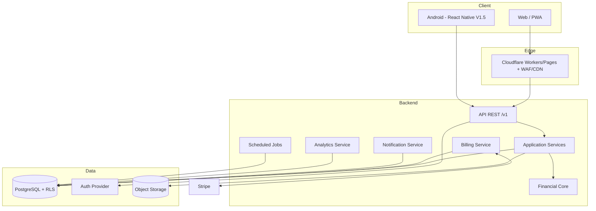
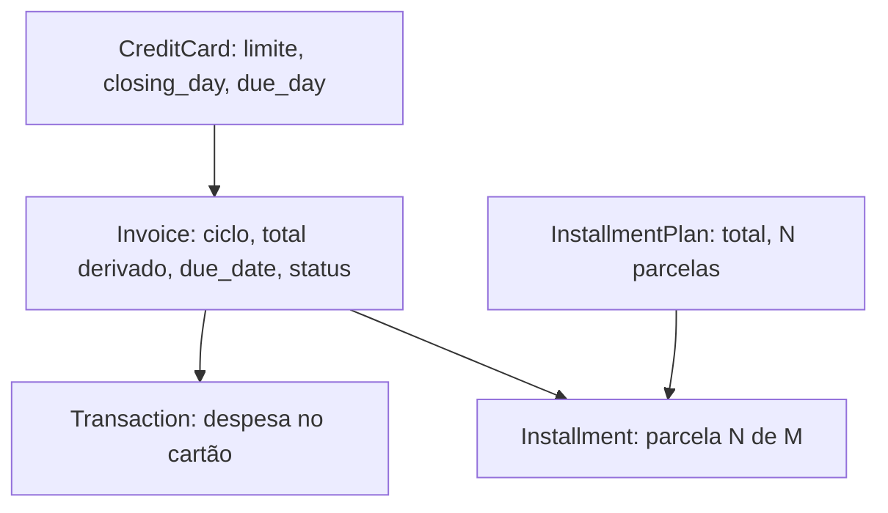
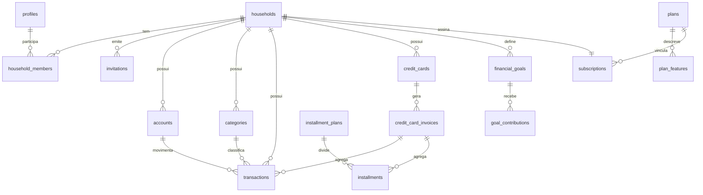
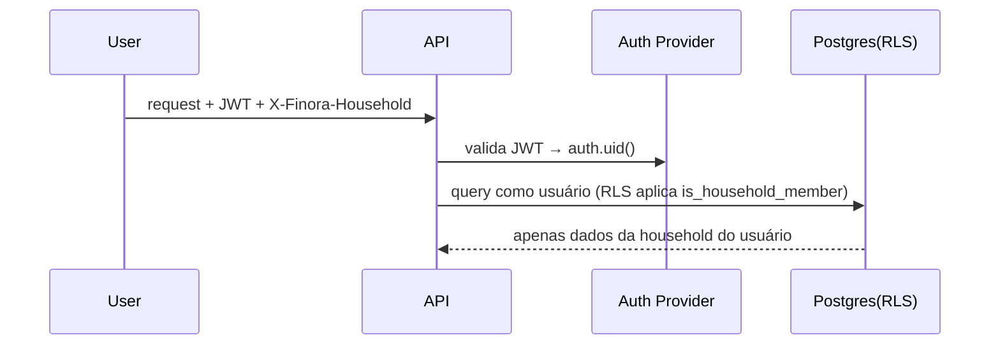
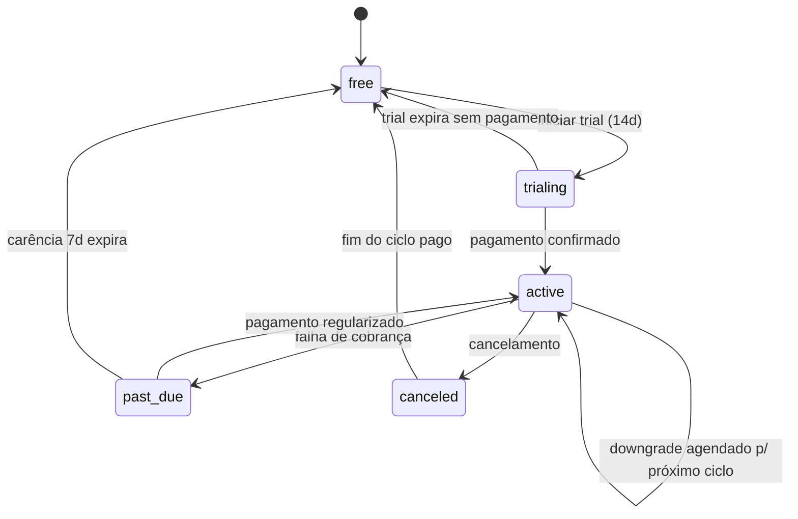

# Tech Design Document — Finora v1.0

## Overview

Este documento é o **Tech Design v1.0** do Finora, derivado da Product Specification v1.0 (`requirements.md`) já analisada. Ele define a arquitetura técnica para evoluir a V0 (React + Vite + LocalStorage, sem backend) para uma plataforma SaaS multi-plataforma de controle financeiro pessoal e familiar.

O design prioriza o **MVP (V1.0)** — Auth, Contas, Transações, Categorias, Pago/Pendente, Cartões/Faturas/Parcelamento, Dashboard, Metas, e Billing Free/Pro — deixando pontos de extensão explícitos para V1.1 (Recorrências), V1.2 (Orçamentos), V1.3 (Family), V1.4 (Import/Export), V1.5 (Android) e V2 (Intelligence).

### Princípios arquiteturais

1. **Financial Core independente de UI.** As regras financeiras vivem em um núcleo puro (sem dependência de framework, HTTP ou banco), reutilizável por Web e Android.
2. **RLS como segurança real.** O isolamento por `household_id` é imposto no PostgreSQL via Row-Level Security, não apenas por filtro na API. RLS mal configurado resulta em negação total de acesso (fail-closed).
3. **Billing é um domínio separado.** Assinaturas e planos SaaS não se misturam com transações financeiras do usuário.
4. **Backend é a fonte de verdade.** LocalStorage/IndexedDB passa a ser cache/offline com fila de sincronização idempotente.
5. **Observabilidade desde o início, sem PII financeira nos logs.**

### Stack alvo

| Camada | Escolha | Papel |
|---|---|---|
| Web/PWA | React 18 + Vite + TypeScript + Tailwind + Recharts | UI, evolução da V0 |
| Edge/Hosting | Cloudflare (Workers/Pages, CDN, DNS, WAF) | Servir a Web, borda, WAF |
| API | REST versionada (`/v1`) sobre Node/TypeScript | Application Services |
| Auth + DB | Supabase (Postgres + Auth + RLS + Storage) | Fonte de verdade, identidade, RLS |
| Pagamentos | Stripe (porta/adaptador) | Billing |
| Mobile (futuro) | React Native | Reaproveita Financial Core + API |

> Nota: Supabase é o candidato para o MVP por entregar Postgres + Auth + RLS + Storage de forma integrada. A arquitetura mantém o domínio financeiro desacoplado do provedor, para permitir troca futura.

## Architecture

### Camadas

```
┌─────────────────────────────────────────────┐
│  UI (React Web / React Native)               │  apresentação
├─────────────────────────────────────────────┤
│  Application Layer (hooks, use-cases)        │  orquestração
├─────────────────────────────────────────────┤
│  Financial Core (regras puras, TS)           │  domínio, sem I/O
├─────────────────────────────────────────────┤
│  Repository / API Client                     │  acesso a dados
├─────────────────────────────────────────────┤
│  API REST /v1  →  Application Services        │  backend
├─────────────────────────────────────────────┤
│  PostgreSQL + RLS (Supabase)                 │  fonte de verdade
└─────────────────────────────────────────────┘
```

O **Financial Core** é compartilhado: roda tanto no cliente (cálculos otimistas, preview offline) quanto no servidor (validação autoritativa). Isso garante que Web e Android usem exatamente as mesmas regras (Req 8, 9, 11, 15).

**Regra arquitetural do Financial Core (fitness function):** o módulo `core/` é TypeScript puro e **não pode importar** React, APIs de browser (DOM, `window`, `localStorage`), clientes de banco, clientes HTTP, o SDK do Supabase nem o SDK do Stripe. Ele opera apenas sobre tipos e funções puras; toda I/O é injetada pelas camadas superiores. Essa restrição é verificada na CI (lint de dependências/import boundaries) para não erodir com o tempo, e é o que permite reaproveitar o mesmo domínio em Web, backend e Android.

### Componentes de alto nível



### Separação de domínios

- **Financial Domain**: contas, transações, categorias, cartões, faturas, parcelamentos, recorrências, orçamentos, metas.
- **Billing Domain**: planos, features, assinaturas, eventos de cobrança, integração Stripe.
- **Identity/Household Domain**: usuários, households, membros, papéis, convites.

Os três domínios se comunicam por interfaces explícitas. O enforcement de limites por plano é o único ponto de contato entre Billing e Financial: o Application Service consulta o Billing (`plan_features`) antes de permitir criação de recursos (Req 17, 18).

## Domain Model

O domínio é organizado em bounded contexts. O Financial Core é código TypeScript puro (sem dependências de I/O), consumido por Application Services no backend e por hooks no cliente.

### Identity

- **Profile**: `id`, `email`, `display_name`, `locale`, `timezone`, identidades vinculadas (Google). Um Profile pode pertencer a várias Households, mas opera sempre em uma **Household ativa** (Req 5.6).

### Household

- **Household**: `id`, `name`, `base_currency` (padrão BRL), `owner_id`.
- **HouseholdMember**: liga Profile↔Household com `role` (`owner|admin|member`).
- **Invitation**: `email`, `role`, `status` (`pending|accepted|expired|revoked`), `expires_at` (+7 dias).
- Invariante: **exatamente um Owner por Household** a qualquer momento (Req 4.13). Transferência de propriedade rebaixa o Owner anterior a Admin (Req 4.12).

### Accounts

- **Account**: `id`, `household_id`, `name`, `type` (`checking|savings|wallet|credit_card`), `initial_balance`, `archived`.
- **Saldo efetivado** = `initial_balance` + entradas efetivadas (income + transfer-in `paid`) − saídas efetivadas (expense + transfer-out `paid`) (Req 6.3, 9.2, 9.3).
- Conta com transações não é excluída, apenas arquivada (Req 6.5, 6.6).

### Transactions

- **Transaction**: `id`, `household_id`, `type` (`income|expense|transfer`), `amount` (>0), `account_id`, `counter_account_id` (só transfer), `category_id` (expense/income), `accrual_date` (competência), `payment_status` (`paid|pending`), `paid_at`, `credit_card_id?`, `installment_id?`.

Invariantes (Financial Core):
- `amount_cents > 0` sempre; valores em centavos inteiros (Req 8.5).
- Transfer: `account_id ≠ counter_account_id` (Req 8.4); **não conta como receita nem despesa** — apenas move saldo entre contas (Req 8.3, 15.4). **Regra central do domínio.**
- Origem registrada em `source` (`manual|sync|import`) com dedupe por `id`, `client_mutation_id` e `external_ref` respectivamente.
- Toda transação está em exatamente um estado `paid` ou `pending` (Req 9.5).
- Competência (`accrual_date`) e pagamento (`payment_status`/`paid_at`) são dimensões independentes (Req 9).

### Credit Cards, Invoices, Installments (fonte de verdade)

Esta é a área mais complexa do domínio. A **fonte de verdade** é definida assim:



- **CreditCard** é fonte de verdade de `limite`, `closing_day`, `due_day`.
- **Transaction** e **Installment** são fonte de verdade dos **valores individuais**.
- **Invoice** é um **agregado derivado**: seu `total` é sempre a soma das transações + parcelas alocadas ao ciclo (Req 10.3). A Invoice nunca armazena valores que não derivem de seus itens; ela materializa `cycle`, `due_date` e `status` (open/closed/paid).
- Alocação: uma despesa/parcela pertence à Invoice do ciclo determinado por `accrual_date` vs `closing_day` (Req 10.2).
- No `closing_day`, a Invoice fecha mesmo sem transações e o processamento prossegue ainda que afete faturas já pagas (Req 10.4).
- **InstallmentPlan**: distribui `total` em N `Installments` com soma exatamente igual ao total; diferença de arredondamento vai para a última parcela (Req 11.2). Cada Installment conta como despesa na sua competência (Req 11.6).
- Despesa que excede o limite é registrada e apenas sinalizada (Req 10.6).

### Recurrences (V1.1)

- **RecurringTransaction**: modelo (`type`, `amount`, `category`, `account`, `frequency` `weekly|monthly|yearly`, `start_date`, `end_date?`, `max_occurrences?`). Gera transações futuras com status inicial `pending` (Req 12.3). Edições afetam apenas ocorrências futuras (Req 12.5).

### Budgets (V1.2)

- **Budget**: `category_id`, `period`, `limit`. Consumo = soma das despesas da categoria no período (Req 13.2). Alertas em 80% e estouro em >100% (Req 13.3, 13.4).

### Goals

- **Goal**: `name`, `target_amount`, `target_date?`, `accumulated` (inicia 0). **Contribution**: aporte positivo (Req 14.6). Progresso = `accumulated / target_amount`. Concluída quando `accumulated ≥ target_amount` (Req 14.5).

### Billing (domínio separado)

- **Plan** (`free|pro|family`), **PlanFeature** (limites e flags), **Subscription** (estado + ciclo), **SubscriptionEvent** (auditoria de cobrança). Detalhado na seção Billing. **Nunca** referencia entidades financeiras diretamente — só expõe limites consultáveis.

### Analytics

- Serviço de leitura que consome Transactions/Installments/Accounts e produz indicadores (saldo, receitas, despesas, pendências, distribuição por categoria, evolução mensal, variação). Regras na seção Analytics.

## Data Models

Esta seção define os modelos de dados persistidos (PostgreSQL). Os agregados e invariantes de domínio estão descritos em Domain Model; aqui detalha-se o schema, constraints, índices e RLS.

### Convenções globais de schema

Estas convenções aplicam-se a **todas** as tabelas, salvo indicação em contrário:

- **Chaves primárias**: `id uuid primary key default gen_random_uuid()`.
- **Escopo de household**: toda tabela financeira tem `household_id uuid not null references households(id) on delete cascade` e é coberta por RLS.
- **Timestamps**: `created_at timestamptz not null default now()` e `updated_at timestamptz not null default now()` (atualizado por trigger). Sempre `timestamptz` (UTC no armazenamento); a conversão para o fuso do usuário é feita na apresentação usando `profiles.timezone`.
- **Dinheiro (obrigatório)**: valores monetários são armazenados como **inteiro em centavos** — coluna `bigint`, sufixo `_cents` (ex.: `amount_cents`, `credit_limit_cents`, `initial_balance_cents`). **Proibido** `float`/`double`/`real`. Exemplo: R$ 99,90 → `9990`. A conversão para exibição (`/100`, formatação BRL) ocorre apenas na camada de apresentação. Isso elimina erros de ponto flutuante em somas de parcelas, saldos e totais de fatura.
- **ON DELETE explícito**: `household_id` usa `on delete cascade`. Referências a dados que não devem sumir com o pai usam `on delete restrict` (ex.: não excluir conta/categoria com transações — Req 6.5, 7.6) ou `on delete set null` quando o vínculo é opcional (ex.: `transactions.credit_card_id`).
- **Soft delete**: usado **apenas** onde o requisito pede preservação de histórico — contas e categorias usam `archived`/substituição (Req 6.6, 7.6). Demais entidades usam hard delete. Não há soft delete genérico.
- **Enums**: tipos enumerados via `create type` (ex.: `account_type`, `tx_type`, `payment_status`, `classification`, `invoice_status`, `subscription_status`, `member_role`).

### Identidade técnica das transações (três origens)

Uma Transaction pode nascer de três origens distintas, e cada uma precisa de um identificador próprio para evitar duplicação em cenários de offline, retry e importação:

```
Transaction
   │
   ├── Manual  → transactions.id (uuid, gerado no cliente/servidor)
   ├── Sync    → sync_mutations.client_mutation_id (idempotência de reenvio)
   └── Import  → transactions.external_ref (id externo do arquivo/origem)
```

- `transactions.id` — identidade canônica do registro.
- `client_mutation_id` (em `sync_mutations`) — deduplica **reenvios** da mesma operação (timeout/retry offline). Ver seção Offline/Sync.
- `transactions.external_ref` (nullable) + `transactions.source` (`manual|sync|import`) — deduplica **importações**: `UNIQUE (household_id, external_ref)` quando `external_ref IS NOT NULL` impede importar o mesmo lançamento duas vezes (Req 20).

Garantia combinada: criar offline → sincronizar → reimportar o mesmo lançamento → reenviar após timeout **nunca** gera duplicatas, pois cada caminho tem sua chave de deduplicação.

### ER simplificado



### Tabelas principais

| Tabela | Chaves/Notas |
|---|---|
| `profiles` | `id` (=auth user id), `email` único, `display_name`, `locale`, `timezone` |
| `households` | `id`, `name`, `base_currency` default `'BRL'`, `owner_id`→profiles |
| `household_members` | PK(`household_id`,`profile_id`), `role` enum(`owner,admin,member`) |
| `invitations` | `id`, `household_id`, `email`, `role`, `status`, `expires_at` |
| `accounts` | `id`, `household_id`, `name`, `type`, `initial_balance_cents` bigint, `archived` bool |
| `categories` | `id`, `household_id`, `name`, `color`, `classification` enum, único(`household_id`,`name`) |
| `transactions` | `id`, `household_id`, `type`, `amount_cents` bigint, `account_id`, `counter_account_id`, `category_id`, `accrual_date` date, `payment_status`, `paid_at` timestamptz, `credit_card_id`, `installment_id`, `source` enum(`manual,sync,import`), `external_ref` (nullable) |
| `credit_cards` | `id`, `household_id`, `name`, `credit_limit_cents` bigint, `closing_day` int, `due_day` int |
| `credit_card_invoices` | `id`, `credit_card_id`, `cycle` (date, 1º dia do ciclo), `due_date`, `status` enum(`open,closed,paid`), único(`credit_card_id`,`cycle`) |
| `installment_plans` | `id`, `household_id`, `total_amount_cents` bigint, `installments_count` int, `credit_card_id?` |
| `installments` | `id`, `installment_plan_id`, `number` int, `amount_cents` bigint, `accrual_date` date, `invoice_id?`, `payment_status` |
| `recurring_transactions` | `id`, `household_id`, `frequency`, `start_date`, `end_date`, `max_occurrences`, `amount_cents` bigint, template fields |
| `budgets` / `budget_categories` | `id`, `household_id`, `period`, `limit_cents` bigint, `category_id` |
| `financial_goals` / `goal_contributions` | `target_amount_cents`, `accumulated_cents`, `amount_cents` (contribuição) |
| `notifications` / `notification_preferences` | notificações e preferências por usuário |
| `plans` / `plan_features` | catálogo de planos e limites |
| `subscriptions` / `subscription_events` | assinatura por household + auditoria de billing |
| `sync_mutations` | `id` uuid PK, `household_id`, `client_mutation_id`, `applied_at`, `result_ref` — **UNIQUE (`household_id`, `client_mutation_id`)** para idempotência de escrita |
| `audit_logs` | `id`, `household_id`, `actor_id`, `operation`, `entity`, `at`, `metadata` (sem PII financeira) |

### Constraints de integridade (invariantes no banco)

- `CHECK (amount_cents > 0)` em `transactions` e `installments`; `CHECK (amount_cents > 0)` em `goal_contributions` (Req 8.5, 14.6). Valores monetários são `bigint` em centavos (nunca float).
- `CHECK (type <> 'transfer' OR account_id <> counter_account_id)` (Req 8.4).
- `CHECK (payment_status IN ('paid','pending'))`; `paid_at` obrigatório quando `paid` (`CHECK (payment_status <> 'paid' OR paid_at IS NOT NULL)`).
- `CHECK (closing_day BETWEEN 1 AND 31 AND due_day BETWEEN 1 AND 31)` em `credit_cards`.
- Enum de tipos de conta, classificação de categoria, status de invoice/subscription, papel de membro, origem de transação.
- Único (`household_id`, `name`) em `categories` (Req 7.7).
- Único (`credit_card_id`, `cycle`) em `credit_card_invoices`.
- Único parcial (`household_id`, `external_ref`) `WHERE external_ref IS NOT NULL` em `transactions` — deduplicação de importação (Req 20).
- Único (`household_id`, `client_mutation_id`) em `sync_mutations` — idempotência de sync/retry (Req 19.5).
- Exatamente um Owner por household: índice único parcial `UNIQUE (household_id) WHERE role = 'owner'` em `household_members` (Req 4.13).
- Soma das parcelas = total: em centavos inteiros a soma é exata (diferença de arredondamento na última parcela); garantida no Financial Core e verificada por trigger/teste de propriedade (Req 11.2).

### Índices principais (performance — Req 23.1)

- `transactions (household_id, accrual_date)` — base do Dashboard e relatórios.
- `transactions (household_id, category_id)` — distribuição por categoria.
- `transactions (household_id, payment_status)` — pendências.
- `transactions (account_id)` — recálculo de saldo.
- `credit_card_invoices (credit_card_id, cycle)`.
- `installments (installment_plan_id)`, `installments (invoice_id)`.

### Row-Level Security (RLS) — segurança real, fail-closed

RLS é habilitado em **todas as tabelas com `household_id`**. A política central verifica que o usuário autenticado é membro da household do registro. Como as tabelas têm RLS ligado e **sem policy permissiva por padrão**, qualquer falha de configuração resulta em **negação total** (fail-closed) (Req 5, 21.3, 21.4).

Função auxiliar de membership:

```sql
create or replace function is_household_member(h uuid)
returns boolean language sql stable security definer as $$
  select exists (
    select 1 from household_members m
    where m.household_id = h and m.profile_id = auth.uid()
  );
$$;
```

Exemplo de política (aplicada por tabela financeira):

```sql
alter table transactions enable row level security;
alter table transactions force row level security;

create policy transactions_select on transactions
  for select using ( is_household_member(household_id) );

create policy transactions_write on transactions
  for all using ( is_household_member(household_id) )
  with check ( is_household_member(household_id) );
```

- `FORCE ROW LEVEL SECURITY` garante que nem o owner da tabela ignore a policy.
- A ausência de policy = nenhum acesso (Postgres nega por padrão quando RLS está ligado). Isso implementa o requisito fail-closed.
- Operações que exigem papel (Owner/Admin) reforçam a checagem no Application Service **e** em policies específicas (ex.: billing, gestão de membros).
- Verificação secundária de membership no Application Service; erro de sistema nessa checagem → nega (Req 5.4).

## Components and Interfaces

Esta seção descreve os componentes do backend (Application Services, Financial Core, Repositories, Jobs) e as interfaces expostas (API REST `/v1`). Componentes de cliente (Web/PWA, Android) e os serviços de Billing, Notifications, Analytics, Auth e Sync são detalhados em suas seções dedicadas mais abaixo e se conectam por estas mesmas interfaces.

### Estilo

REST versionada em `/v1`, JSON, autenticada por token (JWT do provedor de auth). Cada request carrega o `household` ativo (header `X-Finora-Household` validado contra membership).

### Camadas do backend

```
API Route  →  Application Service  →  Financial Core (regras)  →  Repository  →  Postgres
```

- **Application Service**: orquestra caso de uso, aplica autorização por papel, consulta limites de plano no Billing, chama o Financial Core e persiste via Repository dentro de transação de banco.
- **Financial Core**: puro, testável isoladamente (mesmo código do cliente).
- **Repository**: SQL/ORM, respeita RLS (usa a sessão do usuário, não service role, para dados financeiros).

### Endpoints principais (MVP)

| Recurso | Endpoints |
|---|---|
| Auth | `POST /v1/auth/signup`, `/login`, `/logout`, `/password/reset`, `/oauth/google` |
| Profile | `GET/PATCH /v1/me`, `POST /v1/me/email-change` |
| Households | `GET/POST /v1/households`, `PATCH /v1/households/:id`, `POST /:id/transfer-ownership` |
| Members/Invites | `GET/POST /v1/households/:id/invitations`, `POST /v1/invitations/:token/accept`, `PATCH /members/:id/role`, `DELETE /members/:id` |
| Accounts | `GET/POST/PATCH /v1/accounts`, `POST /v1/accounts/:id/archive` |
| Categories | `GET/POST/PATCH/DELETE /v1/categories` |
| Transactions | `GET/POST/PATCH/DELETE /v1/transactions` (income/expense/transfer) |
| Cards/Invoices | `GET/POST/PATCH /v1/credit-cards`, `GET /v1/credit-cards/:id/invoices`, `POST /v1/invoices/:id/pay` |
| Installments | criados via transação parcelada; `DELETE /v1/installment-plans/:id` |
| Goals | `GET/POST/PATCH /v1/goals`, `POST/DELETE /v1/goals/:id/contributions` |
| Analytics | `GET /v1/analytics/dashboard?month=YYYY-MM` |
| Notifications | `GET /v1/notifications`, `POST /v1/notifications/:id/read`, `GET/PATCH /v1/notification-preferences` |
| Billing | `GET /v1/billing/plan`, `POST /v1/billing/subscribe`, `/trial`, `/upgrade`, `/downgrade`, `/cancel`, `POST /v1/billing/webhook` (Stripe) |
| Sync | `POST /v1/sync` (batch de mutations idempotentes) |

### Jobs agendados

| Job | Gatilho | Ação |
|---|---|---|
| Fechamento de fatura | diário | Fecha invoices cujo `closing_day` foi atingido; define `due_date` (Req 10.4) |
| Geração de recorrências (V1.1) | diário | Gera transações devidas com status `pending` (Req 12.3) |
| Vencimentos/notificações | diário | Gera notificações de fatura a vencer, contas em atraso, orçamento, meta (Req 16, 13) |
| Ciclo de billing | diário | Expira trials, aplica carência de past_due, efetiva downgrades no ciclo seguinte (Req 17) |

## Authentication

- **Email/Senha**: senha armazenada apenas como hash resistente a força bruta (bcrypt/argon2 via provedor). Política: mín. 8 caracteres, ao menos 1 letra e 1 dígito (Req 1.3).
- **Google OAuth**: no primeiro login por Google, cria Profile e exige definição de senha local de backup (Req 2.1); e-mail já registrado vincula identidade (Req 2.2).
- **Sessões**: token com expiração por inatividade de 24h (Req 1.4, 21.5). Reset de senha por link válido 60 min que invalida sessões anteriores (Req 1.8, 1.9).
- **Rate limiting**: 5 tentativas inválidas/15 min bloqueiam o e-mail por 15 min; login com credenciais corretas sobrepõe o bloqueio; credenciais incorretas nunca autenticam (Req 1.6, 1.7, 1.11).
- **Fluxo para RLS**: o `auth.uid()` do token é a identidade usada nas policies. O `household` ativo vem no header e é validado contra `household_members`.



## Authorization / RLS

### Matriz de permissões (papéis)

| Operação | Owner | Admin | Member |
|---|---|---|---|
| Ler dados financeiros | ✅ | ✅ | ✅ |
| Criar/editar/excluir transações, contas, categorias | ✅ | ✅ | ✅ |
| Convidar/remover membros, alterar papéis | ✅ | ✅ (convidar) | ❌ |
| Transferir propriedade | ✅ | ❌ | ❌ |
| Gerenciar billing/plano | ✅ | ❌ | ❌ |
| Excluir household | ✅ | ❌ | ❌ |

- Enforcement em duas camadas: **RLS** (isolamento por household) + **Application Service** (papel por operação). Billing e gestão de membros também têm policies específicas.
- Verificação secundária de membership; erro de sistema é tratado como falha de acesso (fail-closed, Req 5.4).
- Alteração de papel só aceita `admin|member` (Req 4.9).

## Billing (domínio separado)

Billing é isolado do domínio financeiro. Só expõe **limites consultáveis** ao Application Service para enforcement (Req 17, 18).

### Subscription Status × Feature Entitlement (conceitos distintos)

Dois conceitos que **não** se confundem:

- **Subscription Status** — o estado de cobrança da assinatura (`free`, `trialing`, `active`, `past_due`, `canceled`, `expired`). É sobre pagamento e ciclo.
- **Feature Entitlement** — o conjunto de recursos e limites efetivamente disponíveis **agora**, derivado do status. Ex.: uma subscription `trialing` de Pro tem entitlement de Pro; uma `past_due` mantém entitlement do plano pago durante a carência; uma `canceled` mantém entitlement pago até o fim do ciclo já pago e depois cai para Free.

O mapeamento status → entitlement é responsabilidade **única** do `FeatureGate`:

```
subscription.status + plan + ciclo  ──►  FeatureGate  ──►  entitlement (limites + flags)
```

Regra arquitetural: **nenhum componente do frontend nem Application Service decide disponibilidade de feature por conta própria.** Todos consultam o `FeatureGate` (`can(feature)` / `limit(resource)`). Isso evita lógica de plano espalhada e mantém uma única fonte de decisão (Req 18).

### Máquina de estados da Subscription



- Free é o estado inicial de toda Household (Req 17.1).
- Trial de 14 dias (Req 17.2); expira para Free se não converter (Req 17.3).
- Upgrade: imediato após pagamento (Req 17.5). Downgrade: aplica no próximo ciclo (Req 17.7); caminho validado (Req 17.6).
- Ao exceder limites após downgrade: dados acima do limite ficam **somente leitura**, criação de novos bloqueada (Req 17.8).
- past_due com carência de 7 dias antes de reverter a Free (Req 17.10).
- Só Owner gerencia billing (Req 17.11).

### Integração de pagamento

Stripe atrás de uma porta `PaymentGateway` (adaptador). Webhooks (`POST /v1/billing/webhook`) atualizam `subscriptions`/`subscription_events`. Nenhum dado de cartão de pagamento trafega/armazena no Finora (delegado ao Stripe).

### Enforcement de limites

`FeatureGate` consulta `plan_features` da subscription ativa. Application Services chamam o gate **antes** de criar recursos:
- Limite quantitativo atingido → rejeita imediatamente com plano necessário (Req 18.1).
- Recurso não habilitado → bloqueia no ato e oferece upgrade (Req 18.2).
- Free limita histórico de relatórios (Analytics respeita a janela) (Req 18.3).

## Web / PWA

Evolução da V0 mantendo o estilo atual (React + Vite + Tailwind + Recharts), reestruturada em camadas:

```
src/
  ui/            componentes e telas (Dashboard, Lançamentos, Contas, Cartões, Metas, Config)
  app/           hooks/use-cases (useTransactions, useDashboard, useBilling…)
  core/          Financial Core (compartilhado com backend/mobile)
  data/          repositórios: remoto (API) + local (IndexedDB cache)
  sync/          fila de sincronização
```

- **Roteamento**: React Router; áreas autenticadas protegidas por guarda de sessão.
- **Estado**: server-state via React Query (cache, revalidação); UI-state local.
- **PWA**: service worker para app-shell e cache de leitura; instalável (Req 19.1).
- **Sync inicial**: interface acessível, dados bloqueados até a primeira sync concluir (Req 19.2).
- **Offline**: com cache → acesso total sem indicação de offline (Req 19.3); sem cache (instalação nova) → bloqueia e pede conexão (Req 19.4).

## Android (V1.5)

React Native reaproveitando **o mesmo Financial Core** (`core/`) e os contratos da API `/v1`. Compartilhado: regras financeiras, tipos, cliente de API, lógica de sync. Específico: navegação nativa, UI, storage local (SQLite/AsyncStorage). Nenhuma regra financeira é reimplementada.

## Offline / Sync

```mermaid
graph LR
  L[Local store: IndexedDB] --> Q[Sync Queue: mutations]
  Q --> CR[Conflict Resolution]
  CR --> API[/v1/sync]
  API --> PG[(PostgreSQL)]
```

- Cada mutação recebe um **client mutation id** (UUID) gerado no cliente. O backend registra em `sync_mutations` com **UNIQUE (`household_id`, `client_mutation_id`)** e ignora reenvios (retry/retry/retry produzem uma única mutação) → **idempotência**, evitando transações duplicadas. Um reenvio retorna o `result_ref` da aplicação original em vez de reaplicar.
- Escrita offline entra na fila; ao reconectar, a fila é drenada em ordem (Req 19.5).
- **Conflito**: se local e servidor divergem sobre o mesmo registro, o sistema **preserva ambas as versões** e sinaliza para resolução do usuário (Req 19.6). Estratégia: last-write-wins não é aplicada silenciosamente em dados financeiros.
- Cacheável: dados de leitura da household ativa (contas, transações do período, categorias, faturas).

## Notifications

- **Geração** (jobs diários): fatura a ≤3 dias do vencimento e pendente (Req 16.1); conta pendente vencida (Req 16.2); orçamento 80%/100% (Req 13.3, 13.4); meta atingida (Req 14.5).
- **Central**: exibe lidas e não lidas juntas; lidas permanecem visíveis (Req 16.3). Estado muda para lida só por marcação explícita (Req 16.4).
- **Preferências**: usuário pode desativar qualquer categoria, inclusive críticas (Req 16.5).
- **Canais**: in-app no MVP; push/e-mail como extensão futura.

## Analytics

Cálculos derivados dos requisitos, executados no backend (com o mesmo Financial Core para consistência):

- Saldo total = soma dos saldos de contas ativas em Base_Currency (Req 15.1).
- Receitas = soma de `income` com competência no período (Req 15.2).
- Despesas = soma de `expense` + `installments` no período (Req 15.3).
- **Exclui `transfer`** de receitas e despesas (Req 15.4).
- Total pendente = soma acumulada de todas as transações `pending` no período (Req 9.3, 15.5).
- Distribuição por categoria (nome, cor, total), só categorias com total > 0 (Req 15.6).
- Evolução mensal por `YYYY-MM` em ordem cronológica (Req 15.7).
- Variação percentual mês atual vs anterior quando há ≥2 meses (Req 15.13).
- Filtro de mês: sucesso mostra indicador breve (Req 15.9); falha mostra aviso mesmo sem filtro prévio (Req 15.10); sem dados anteriores → dashboard vazio + aviso (Req 15.11); com dados → dados anteriores + aviso (Req 15.12).

**Performance**: Dashboard com até 5.000 transações em <2s p95 (Req 23.1). Estratégia: índices dedicados; se necessário, **materialized views** por household/mês atualizadas por trigger/job para consolidações pesadas.

## Security / LGPD

- TLS em todo tráfego (Req 21.1).
- Senhas só como hash resistente a força bruta (Req 21.2).
- RLS por household em toda leitura/escrita financeira; fail-closed (Req 21.3, 21.4).
- Sessão exige reautenticação após 24h de inatividade (Req 21.5); token inválido/expirado é negado (Req 21.6).
- **LGPD**: export de dados pessoais em formato estruturado no prazo legal; se inviável, falha e notifica (Req 22.1, 22.2). Exclusão/anonimização quando não há impedimento de propriedade (Req 22.3). Consentimento registrado no primeiro acesso, antes de processar exclusões (Req 22.4). Acesso a dados pessoais restrito ao próprio usuário e processos internos (Req 22.5).
- **Logs sem PII financeira**: valores monetários e dados pessoais são mascarados/omitidos.

## Observability

Logs estruturados (JSON) com campos de correlação, **sem dados financeiros sensíveis**:

```
request_id, correlation_id, user_id, household_id, operation, duration_ms, status, error_code
```

- Valores de transação, nomes e e-mails **não** são logados (ou são mascarados).
- Métricas: latência p95 por operação, taxa de erro, filas de sync, jobs de billing/fatura.
- SLO: disponibilidade mensal ≥ 99,5% para auth e consulta (Req 23.3).
- Logs de auth, erros de aplicação e falhas de cobrança são registrados (Req 23.4).

## Deployment / CI-CD

- **Web**: build Vite publicado no Cloudflare (Workers/Pages). O `wrangler.toml` atual (build `npm run build`, assets `./dist`, SPA fallback) permanece válido para a Web.
- **Backend + DB**: Supabase (Postgres gerenciado + Auth + RLS). Migrações de schema versionadas (SQL em `supabase/migrations` ou ferramenta equivalente), aplicadas por pipeline.
- **Ambientes**: `dev` → `staging` → `prod`, cada um com projeto Supabase e ambiente Cloudflare próprios.
- **CI/CD**: pipeline por push — lint, testes (unit do Core, integração de API + RLS, e2e principais), build, deploy. Secrets via variáveis de ambiente do provedor (nunca no repositório).
- **Versionamento de design**: snapshots publicáveis em `docs/architecture/tech-design-vX.Y.md` quando houver mudança arquitetural relevante; `.kiro/specs/finora-saas/design.md` é o artefato vivo do workflow.

## Error Handling

- **Formato de erro da API**: `{ error: { code, message, details? } }`, HTTP status coerente (400 validação, 401 auth, 403 autorização, 409 conflito/limite, 422 regra de negócio, 5xx servidor).
- **Idempotência**: escritas aceitam client mutation id; reenvio retorna o resultado original sem duplicar (sync e transações).
- **Falha de escrita**: preserva o estado anterior consistente **e** retorna mensagem de erro — só é considerada tratada quando ambas ocorrem (Req 23.5).
- **Falha de recálculo de saldo**: a alteração/exclusão da transação é concluída mesmo assim; o recálculo é reprocessado de forma assíncrona/reconciliada (Req 8.8).
- **Registro de categoria falho**: categoria não aparece na UI até persistir com sucesso (Req 7.2).
- **Limite de cartão excedido**: registra e sinaliza, não bloqueia (Req 10.6).

## Correctness Properties

Propriedades invariantes que o sistema deve preservar, verificáveis por testes (ver Testing Strategy).

### Property 1: Transfer é neutra em receita/despesa
Para qualquer conjunto de transações, a soma de receitas e a soma de despesas dos relatórios não mudam ao adicionar ou remover transferências; apenas os saldos das contas envolvidas mudam.
**Validates: Requirements 8.3, 15.4**

### Property 2: Positividade de valores
Toda transação, parcela e contribuição persistida tem `amount > 0`.
**Validates: Requirements 8.5, 14.6**

### Property 3: Soma de parcelas igual ao total
Para qualquer `total` e `N`, a soma das N parcelas geradas é exatamente igual ao total, com a diferença de arredondamento alocada à última parcela.
**Validates: Requirements 11.2**

### Property 4: Fatura é sempre derivada dos itens
O total de uma Invoice é sempre igual à soma das transações e parcelas alocadas ao seu ciclo; não há valor armazenado fora dessa soma.
**Validates: Requirements 10.3**

### Property 5: Exatamente um estado de pagamento
Toda transação está em `paid` ou `pending`, nunca em ambos nem em nenhum.
**Validates: Requirements 9.5**

### Property 6: Total pendente é acumulativo
O total pendente é a soma de todas as transações `pending` do período, não o valor de uma única transação.
**Validates: Requirements 9.3, 15.5**

### Property 7: Exatamente um Owner por Household
Em qualquer instante, cada Household tem exatamente um membro com papel Owner.
**Validates: Requirements 4.13**

### Property 8: Isolamento por Household (fail-closed)
Nenhuma consulta retorna registros de uma Household da qual o usuário não é membro; RLS mal configurado nega todo acesso.
**Validates: Requirements 5.1, 21.3**

### Property 9: Idempotência de sync
Aplicar a mesma mutação (mesmo client mutation id) mais de uma vez produz o mesmo estado que aplicá-la exatamente uma vez.
**Validates: Requirements 19.5**

### Property 10: Round-trip de portabilidade
Exportar e reimportar em uma Household vazia produz um dataset equivalente ao original.
**Validates: Requirements 20.4**

## Testing Strategy

- **Unit (Financial Core)**: regras puras — transfer não vira receita/despesa; competência×pagamento; saldo efetivado; alocação de fatura por ciclo.
- **Property-based**: soma das parcelas = total (com arredondamento na última) para N e valores arbitrários (Req 11.2); round-trip export→import produz dataset equivalente (Req 20.4).
- **Integração (API + RLS)**: usuário de uma household não acessa dados de outra; RLS desligado/mal configurado nega acesso (fail-closed); enforcement de papéis.
- **Billing**: transições de estado (trial→active→past_due→free), enforcement de limites, downgrade somente-leitura.
- **Sync**: idempotência (reenvio não duplica), resolução de conflito preserva ambas as versões.
- **e2e**: signup/login, criar conta+transação, transferência, despesa parcelada no cartão + fatura, dashboard com filtro de mês, criar meta + contribuição.

## Requirements Traceability

| Seção do Design | Requisitos atendidos |
|---|---|
| Authentication | 1, 2, 21.5, 21.6 |
| Authorization / RLS | 4, 5, 21.3, 21.4 |
| Domain: Accounts | 6 |
| Domain: Categories | 7 |
| Domain: Transactions | 8, 9 |
| Domain: Cards/Invoices/Installments | 10, 11 |
| Domain: Recurrences | 12 (V1.1) |
| Domain: Budgets | 13 (V1.2) |
| Domain: Goals | 14 |
| Analytics | 9.3, 15, 23.1 |
| Notifications | 13.3, 13.4, 14.5, 16 |
| Billing | 17, 18 |
| Web / PWA / Offline-Sync | 19 |
| Data Portability | 20 (V1.4) |
| Security / LGPD | 21, 22 |
| Observability / Deployment | 23 |

## Extension Points (pós-MVP)

- **V1.1 Recorrências**: `recurring_transactions` + job de geração já previstos no schema/jobs.
- **V1.2 Orçamentos**: `budgets`/`budget_categories` + notificações de consumo.
- **V1.3 Family**: papéis e convites já modelados; ativar limites do plano Family.
- **V1.4 Import/Export**: endpoints e propriedade de round-trip definidos.
- **V1.5 Android**: Financial Core e API `/v1` compartilhados.
- **V2 Finora Intelligence**: serviço de insights sobre os dados de Analytics, isolado como novo bounded context.
