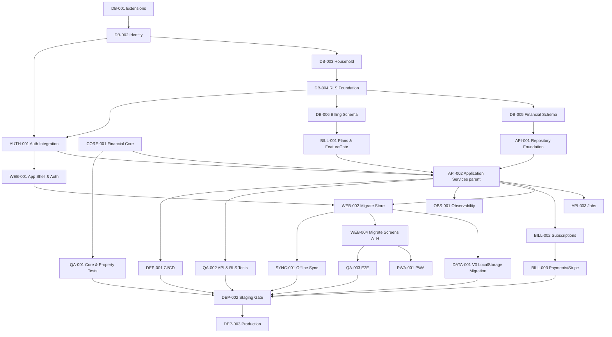

# Implementation Plan — Finora SaaS v1.0

## Overview

Sequência de implementação **arquitetural** derivada de `design.md`, não um backlog de funcionalidades. As tarefas seguem a ordem de dependências (Foundation → Domain → Backend → Web → Billing → Mobile → Observability → Quality → Deployment) e mantêm o **V0 funcional** durante toda a transição (migração incremental).

## Estratégia de migração incremental

```
V0 atual (funcional) → Foundation → Backend+DB → Auth → Migrar Store →
Migrar Dashboard → Migrar Lançamentos → Novos módulos → PWA → Android
```

O app V0 permanece no ar e utilizável até que cada camada equivalente esteja pronta e validada. Nenhuma tela é removida antes de seu substituto estar funcional.

## Task Dependency Graph



As waves indicam grupos de tarefas que podem ser executadas em paralelo, respeitando as dependências entre waves:

```json
{
  "waves": [
    { "wave": 1, "tasks": [1] },
    { "wave": 2, "tasks": [2] },
    { "wave": 3, "tasks": [3] },
    { "wave": 4, "tasks": [4] },
    { "wave": 5, "tasks": [5, 9] },
    { "wave": 6, "tasks": [31, 6, 7] },
    { "wave": 7, "tasks": [8, 10, 11] },
    { "wave": 8, "tasks": [12, 14] },
    { "wave": 9, "tasks": [13, 19, 23, 24, 27] },
    { "wave": 10, "tasks": [15, 20] },
    { "wave": 11, "tasks": [16, 17, 18, 30] },
    { "wave": 12, "tasks": [21, 22, 25, 26] },
    { "wave": 13, "tasks": [28] },
    { "wave": 14, "tasks": [29] }
  ]
}
```

> As subtarefas (12.1–12.10 e 17.1–17.8) executam dentro das waves de seus parents (8 e 11), podendo ser paralelizadas entre si conforme suas dependências específicas. AUTH-001 (tarefa 9) sobe cedo (wave 5), independente do financeiro, permitindo login/autorização antes da migração financeira.

## Tasks

- [x] 1. FOUNDATION — Preparar monorepo e fronteiras de módulos sem quebrar o V0
  - **Objetivo:** estabelecer a estrutura de pastas (`core/`, `app/`, `data/`, `sync/`, futura `api/`) e as fronteiras de import, mantendo o app V0 buildando e no ar.
  - **Contexto:** design.md §Architecture, §Web/PWA, princípio do Financial Core.
  - **Arquivos/módulos:** `src/core/`, `src/app/`, `src/data/`, `src/sync/`, config de lint de import boundaries (ex.: eslint-plugin-boundaries), `package.json`.
  - **Dependências:** nenhuma.
  - **Implementação:** criar diretórios vazios com index barrels; configurar regra de lint proibindo `core/` de importar React/browser/DB/HTTP/Supabase/Stripe; mover utilitários puros existentes (`lib/calc.ts`) para `core/` sem alterar comportamento.
  - **Critérios de aceitação:** `npm run build` e o V0 continuam funcionando; lint falha se `core/` importar dependência proibida.
  - **Testes:** lint de boundaries passa; build verde.
  - **DoD:** V0 intacto, estrutura e fitness function de imports ativas.
  - _Requirements: design §Architecture (Financial Core independente de UI)_

- [x] 2. DB-001 — Extensões e convenções base do PostgreSQL
  - **Objetivo:** provisionar o projeto Postgres/Supabase e habilitar extensões e convenções globais.
  - **Contexto:** design.md §Data Models (Convenções globais).
  - **Arquivos/módulos:** `supabase/migrations/0001_extensions.sql`.
  - **Dependências:** Tarefa 1.
  - **Implementação:** habilitar `pgcrypto` (para `gen_random_uuid()`); criar tipos enum (`account_type`, `tx_type`, `payment_status`, `classification`, `invoice_status`, `subscription_status`, `member_role`, `tx_source`, `frequency`); trigger genérico de `updated_at`.
  - **Critérios de aceitação:** migração aplica sem erro em ambiente limpo; enums e trigger disponíveis.
  - **Testes:** migração roda em CI contra Postgres efêmero.
  - **DoD:** base do schema pronta para as demais migrações.
  - _Requirements: 21, design §Data Models_

- [x] 3. DB-002 — Schema de Identity (profiles)
  - **Objetivo:** criar `profiles` vinculado ao usuário de auth.
  - **Contexto:** design.md §Domain Model (Identity), §Data Models.
  - **Arquivos/módulos:** `supabase/migrations/0002_identity.sql`.
  - **Dependências:** DB-001.
  - **Implementação:** tabela `profiles` (`id` = auth uid, `email` único case-insensitive, `display_name`, `locale`, `timezone`, timestamps); trigger `set_updated_at`; FK `profiles_id_fkey → auth.users` condicional (com `RAISE NOTICE` quando o schema `auth` não existe, ex.: PGlite).
  - **Critérios de aceitação:** criar um usuário de auth gera/permite um profile correspondente.
  - **Testes:** validado via PGlite (`run-migration.mjs`): colunas/tipos/defaults, índice único case-insensitive, trigger, idempotência. Verificação de produção via `verify-prod.mjs` (ver GATE 1).
  - **DoD:** identidade persistida e única.
  - _Requirements: 1, 3_

- [x] 4. DB-003 — Schema de Household (households, members, invitations)
  - **Objetivo:** modelar grupo familiar, membros e convites.
  - **Contexto:** design.md §Domain Model (Household).
  - **Arquivos/módulos:** `supabase/migrations/0003_household.sql`.
  - **Dependências:** DB-002.
  - **Implementação:** `households` (`owner_id → profiles` on delete restrict), `household_members` (PK composta, `role`, FKs cascade), `invitations` (`status`, `expires_at` default +7d); índice único parcial `household_one_owner (household_id) WHERE role='owner'`; trigger `sync_household_owner` mantém `households.owner_id` consistente com o owner real.
  - **Critérios de aceitação:** impossível ter dois owners na mesma household; convite expira por `expires_at`.
  - **Testes:** validado via PGlite — teste negativo de "um owner" com 4 bordas (INSERT, promoção via UPDATE, owner em outra household, transferência) + sincronização de `owner_id`.
  - **DoD:** invariante "um Owner por household" garantida no banco.
  - _Requirements: 4_

- [x] 5. DB-004 — Fundação de RLS (fail-closed) e helper de membership
  - **Objetivo:** estabelecer a base de segurança por household antes de qualquer dado financeiro.
  - **Contexto:** design.md §Data Models (RLS), §Authorization.
  - **Arquivos/módulos:** `supabase/migrations/0004_rls_foundation.sql`.
  - **Dependências:** DB-003.
  - **Implementação:** `is_household_member(uuid)` e `has_household_role(uuid, member_role[])` (`security definer stable`, `search_path` fixo); `ENABLE` + `FORCE ROW LEVEL SECURITY` em `households`, `household_members`, `invitations`, `profiles`; leitura por membership; escrita de gestão de membros/convites restrita a owner/admin (matriz de permissões); `profiles` restrito ao próprio usuário; stub condicional de `auth.uid()` (só onde o schema `auth` não existe).
  - **Critérios de aceitação:** sem policy → nenhum acesso; usuário A não lê household B; `is_household_member` sem recursão.
  - **Testes:** validado via PGlite (role não-superusuário + GUC de sessão): FORCE ativo (não só ENABLE); fail-closed (sem policy → 0 linhas); `is_household_member` retorna false p/ entradas inválidas (uid nulo, household/profile inexistente, null); A→B; member não convida / admin convida; profiles self-only.
  - **DoD:** fundação fail-closed comprovada por teste.
  - _Requirements: 5, 21.3, 21.4 — valida Correctness Property 8_

- [x] 31. GATE 1 — Verificação da fundação contra o Supabase real (`verify-prod.mjs`)
  - **Objetivo:** garantir que invariantes que só existem no banco real (não no PGlite) estejam presentes antes de fechar o GATE 1. Impede que passos manuais documentados sejam esquecidos sob pressão de prazo.
  - **Contexto:** design.md §Data Models (FK/RLS); `supabase/README.md` §Verificação pós-deploy.
  - **Arquivos/módulos:** `supabase/tests/verify-prod.mjs`, devDependency `pg`.
  - **Dependências:** DB-002, DB-003, DB-004, e projeto Supabase provisionado (`DATABASE_URL`).
  - **Implementação:** aplicar as migrações 0001–0004 no Supabase real; rodar `DATABASE_URL=... node supabase/tests/verify-prod.mjs`; estender o script com as invariantes de DB-003/DB-004 (ex.: presença das policies de RLS e do índice único parcial de owner) conforme forem entregues.
  - **Critérios de aceitação:** `verify-prod.mjs` sai com código 0 contra o Supabase real; `profiles_id_fkey` confirmada.
  - **Regra de gate:** **GATE 1 não fecha enquanto `verify-prod.mjs` não estiver verde contra o Supabase real.** Também deve compor o gate de staging (DEP-002).
  - **DoD:** fundação (Identity + Household + RLS) verificada no ambiente real, não só no PGlite.
  - _Requirements: 5, 21.3, 21.4_

- [x] 6. DB-005 — Schema Financeiro (accounts, categories, transactions, cards, invoices, installments)
  - **Objetivo:** criar o núcleo de dados financeiros com dinheiro em centavos e RLS.
  - **Contexto:** design.md §Data Models (tabelas, constraints, índices), §Domain Model.
  - **Arquivos/módulos:** `supabase/migrations/0005_financial.sql`.
  - **Dependências:** DB-004.
  - **Implementação:** tabelas `accounts`, `categories`, `transactions`, `credit_cards`, `credit_card_invoices`, `installment_plans`, `installments` com colunas `_cents bigint`, `source`, `external_ref`; CHECKs (`amount_cents>0`, transfer origem≠destino, paid_at quando paid, dias 1–31); UNIQUEs (categoria por household, invoice por ciclo, `external_ref` parcial); índices do design; RLS + FORCE em todas.
  - **Critérios de aceitação:** todas as constraints e RLS ativas; nenhuma coluna monetária float.
  - **Testes:** CHECKs rejeitam valores inválidos; RLS isola por household; importação duplicada por `external_ref` é bloqueada.
  - **DoD:** schema financeiro íntegro e isolado.
  - _Requirements: 6, 7, 8, 9, 10, 11, 20_

- [x] 7. DB-006 — Schema de Billing (plans, plan_features, subscriptions, events) + sync/audit
  - **Objetivo:** persistir billing como domínio separado e as tabelas transversais de sync/auditoria.
  - **Contexto:** design.md §Billing, §Offline/Sync, §Observability.
  - **Arquivos/módulos:** `supabase/migrations/0006_billing_sync_audit.sql`.
  - **Dependências:** DB-004.
  - **Implementação:** `plans`, `plan_features`, `subscriptions` (`status`, ciclo), `subscription_events`; `sync_mutations` com `UNIQUE (household_id, client_mutation_id)`; `audit_logs`; seed dos planos Free/Pro/Family conforme a Matriz de Planos.
  - **Critérios de aceitação:** reenvio com mesmo `client_mutation_id` é rejeitado pela unicidade; seeds de plano presentes.
  - **Testes:** unicidade de mutation; leitura de `plan_features`.
  - **DoD:** billing e idempotência prontos no banco.
  - _Requirements: 17, 18, 19.5 — valida Correctness Property 9_

- [x] 8. CORE-001 — Financial Core (regras puras, sem I/O)
  - **Objetivo:** implementar as regras financeiras compartilhadas por backend/web/mobile.
  - **Contexto:** design.md §Domain Model, §Correctness Properties, princípio do Financial Core.
  - **Arquivos/módulos:** `packages/core/src/{money,types,transactions,invoice,analytics}.ts` + testes `*.test.ts`.
  - **Dependências:** Tarefa 1.
  - **Implementação:** aritmética em centavos; validação de transação (amount>0, transfer origem≠destino); saldo efetivado (só `paid`); transfer neutra; alocação de fatura por ciclo (closing_day) e total derivado; divisão de parcelas com sobra na última; totais de analytics (exclui transfer, pendente acumulado). Puro, sem imports proibidos (verificado). Test runner: Vitest + fast-check; `typecheck` de produção exclui testes (mantém a fitness function de pureza no `src`).
  - **Critérios de aceitação:** funções puras determinísticas; nenhuma dependência de I/O; typecheck de produção limpo.
  - **Testes:** 17 testes verdes, incluindo property-based — Property 1 (transfer neutra), 2 (amount>0), 3 (soma parcelas=total), 6 (pendente acumulado), 4 (fatura derivada).
  - **DoD:** Core cobre as invariantes e passa nos testes de propriedade.
  - _Requirements: 8, 9, 10, 11, 15 — valida Correctness Properties 1–4, 6_

- [x] 9. AUTH-001 — Integração de autenticação (email/senha + Google, sessões)
  - **Objetivo:** habilitar login/cadastro, OAuth Google, reset e sessão de 24h, fluindo `auth.uid()` para o RLS.
  - **Contexto:** design.md §Authentication.
  - **Arquivos/módulos:** `src/data/auth.ts`, config do provedor (Supabase Auth), `api/auth/*` (rotas finas).
  - **Dependências:** DB-002, DB-004 (Identity + RLS). **Independente da implementação financeira** — login/autorização funcionam antes de migrar o financeiro.
  - **Implementação:** cadastro cria Profile + Household Owner; Google exige senha de backup; política de senha; rate limit 5/15min com override por credencial correta; reset invalida sessões.
  - **Critérios de aceitação:** sessão expira em 24h de inatividade; credencial incorreta nunca autentica; funciona sem nenhum serviço financeiro presente.
  - **Testes:** fluxos de sucesso/erro; bloqueio/override; expiração.
  - **DoD:** identidade autenticada disponível para os Application Services.
  - _Requirements: 1, 2, 3, 21.5, 21.6_

- [ ] 10. API-001 — Repository Foundation (acesso a dados sob RLS)
  - **Objetivo:** camada de repositório que executa como o usuário (respeitando RLS) com transações de banco.
  - **Contexto:** design.md §Components and Interfaces.
  - **Arquivos/módulos:** `api/repositories/*`, `api/db/client.ts`.
  - **Dependências:** DB-005, DB-006.
  - **Implementação:** repositórios por agregado; sessão do usuário (não service role) para dados financeiros; unidade de trabalho transacional; mapeamento de/para centavos.
  - **Critérios de aceitação:** repositórios nunca contornam RLS; escrita em transação atômica.
  - **Testes:** integração com Postgres; verificação de isolamento.
  - **DoD:** acesso a dados seguro e transacional.
  - _Requirements: 5, 21.3_

- [x] 11. BILL-001 — Plans & FeatureGate (entitlement) — parte pura (core)
  - **Objetivo:** fonte única de decisão de disponibilidade/limite de recursos por plano.
  - **Contexto:** design.md §Billing (Status × Entitlement; dois eixos: direito por plano vs status de release).
  - **Arquivos/módulos:** `packages/core/src/plans.ts` (Matriz como dados) + `packages/core/src/entitlement.ts` (decisões puras) + testes. A parte que mapeia `subscription.status → PlanId efetivo` (trial/past_due/canceled/ciclo) fica em BILL-002 (Application Service), pois depende de datas/estado.
  - **Dependências:** Tarefa 1 (parte pura; independe de DB-006).
  - **Implementação:** `canCreate(plan,resource,count)` (nega em `count >= limite`), `canUse(plan,feature)`, `exceedsLimit(plan,resource,count)` (nega em `count > limite`, pós-downgrade Req 17.8), `limitFor`, `hasFeature`, `reportHistoryMonths`. Puro, sem I/O. **Fronteira:** gate = direito por plano (estável, na Matriz); status de release = outra camada (app), nunca no core.
  - **Critérios de aceitação:** nenhuma decisão de plano fora do FeatureGate; funções puras.
  - **Testes:** 12 testes (unit + property-based) — invariante "nunca permite acima do limite" p/ qualquer plano/recurso/contagem; limites exatos; features por plano; coerência canCreate×exceedsLimit.
  - **DoD:** enforcement centralizado (parte pura) disponível para os serviços.
  - _Requirements: 17, 18_

- [ ] 12. API-002 — Application Services (parent: casos de uso por módulo)
  - **Objetivo:** orquestrar autorização por papel, FeatureGate, Financial Core e repositórios, um serviço por domínio para permitir teste isolado.
  - **Contexto:** design.md §Components and Interfaces, §Authorization, §Error Handling.
  - **Arquivos/módulos:** `api/services/*`, rotas `api/v1/*`.
  - **Dependências:** CORE-001, API-001, AUTH-001, BILL-001.
  - **Implementação:** padrão comum a todos os serviços — verificação secundária de membership (fail-closed); idempotência de escrita; erro preserva estado E retorna mensagem; falha de recálculo não bloqueia a operação; enforcement via FeatureGate. As subtarefas abaixo implementam cada serviço.
  - **Critérios de aceitação:** todas as subtarefas concluídas; contratos do design implementados.
  - **DoD:** API MVP funcional e autorizada, com testes por domínio.
  - _Requirements: 4, 5, 6, 7, 8, 9, 10, 11, 14, 15, 17, 18, 23.5, 8.8_

- [ ] 12.1 API-002A — Account Service
  - **Objetivo:** CRUD de contas, arquivamento, saldo; enforcement de limite de contas.
  - **Arquivos/módulos:** `api/services/accounts.ts`, `api/v1/accounts`.
  - **Dependências:** API-002 (parent).
  - **Critérios de aceitação:** conta com transações não é excluída (arquiva); limite via FeatureGate.
  - _Requirements: 6, 18_

- [ ] 12.2 API-002B — Transaction Service (income/expense)
  - **Objetivo:** criar/editar/excluir receitas e despesas com competência e status de pagamento.
  - **Arquivos/módulos:** `api/services/transactions.ts`, `api/v1/transactions`.
  - **Dependências:** API-002 (parent).
  - **Critérios de aceitação:** `amount_cents>0`; recálculo de saldo; alternância paid/pending.
  - _Requirements: 8, 9_

- [ ] 12.3 API-002C — Transfer Service
  - **Objetivo:** movimentação entre contas (não é receita nem despesa).
  - **Arquivos/módulos:** `api/services/transfers.ts` (ou parte de transactions).
  - **Dependências:** API-002B.
  - **Critérios de aceitação:** origem≠destino; não afeta totais de receita/despesa.
  - _Requirements: 8.3, 8.4, 15.4 — valida Correctness Property 1_

- [ ] 12.4 API-002D — Credit Card Service
  - **Objetivo:** CRUD de cartões com limite/fechamento/vencimento.
  - **Arquivos/módulos:** `api/services/cards.ts`, `api/v1/credit-cards`.
  - **Dependências:** API-002 (parent).
  - **Critérios de aceitação:** dias 1–31; despesa que excede limite registra e sinaliza.
  - _Requirements: 10_

- [ ] 12.5 API-002E — Invoice Service
  - **Objetivo:** faturas por ciclo, total derivado, fechamento e pagamento.
  - **Arquivos/módulos:** `api/services/invoices.ts`, `api/v1/invoices`.
  - **Dependências:** API-002D.
  - **Critérios de aceitação:** total = soma dos itens; fechamento no closing_day; pagamento reflete no saldo.
  - _Requirements: 10 — valida Correctness Property 4_

- [ ] 12.6 API-002F — Installment Service
  - **Objetivo:** parcelamento com distribuição exata em centavos.
  - **Arquivos/módulos:** `api/services/installments.ts`.
  - **Dependências:** API-002E.
  - **Critérios de aceitação:** soma das parcelas = total; alocação a faturas subsequentes.
  - _Requirements: 11 — valida Correctness Property 3_

- [ ] 12.7 API-002G — Recurring Transaction Service [V1.1]
  - **Objetivo:** modelos de recorrência (geração é job).
  - **Arquivos/módulos:** `api/services/recurring.ts`.
  - **Dependências:** API-002B.
  - **Critérios de aceitação:** habilitado só por plano; edição afeta ocorrências futuras.
  - _Requirements: 12_

- [ ] 12.8 API-002H — Budget Service [V1.2]
  - **Objetivo:** orçamentos por categoria/período e consumo.
  - **Arquivos/módulos:** `api/services/budgets.ts`.
  - **Dependências:** API-002B.
  - **Critérios de aceitação:** habilitado só por plano; alertas 80%/100%.
  - _Requirements: 13_

- [ ] 12.9 API-002I — Goal Service
  - **Objetivo:** metas e contribuições positivas.
  - **Arquivos/módulos:** `api/services/goals.ts`, `api/v1/goals`.
  - **Dependências:** API-002 (parent).
  - **Critérios de aceitação:** contribuição>0; conclusão quando acumulado≥alvo.
  - _Requirements: 14 — valida Correctness Property 2_

- [ ] 12.10 API-002J — Analytics Service
  - **Objetivo:** indicadores/relatórios consolidados do Dashboard.
  - **Arquivos/módulos:** `api/services/analytics.ts`, `api/v1/analytics/dashboard`.
  - **Dependências:** API-002B, API-002F.
  - **Critérios de aceitação:** exclui transfer; pendente acumulado; <2s p95 até 5000 transações.
  - _Requirements: 15, 23.1 — valida Correctness Properties 5, 6_

- [ ] 13. API-003 — Jobs agendados (fatura, notificações, billing)
  - **Objetivo:** processos periódicos do design.
  - **Contexto:** design.md §Components and Interfaces (Jobs).
  - **Arquivos/módulos:** `api/jobs/{invoice-close,notifications,billing-cycle}.ts`, agendador.
  - **Dependências:** API-002.
  - **Implementação:** fechamento de fatura no closing_day (prossegue mesmo afetando pagas); notificações de vencimento/atraso/meta; expiração de trial e carência de past_due, downgrade no próximo ciclo.
  - **Critérios de aceitação:** jobs idempotentes e observáveis.
  - **Testes:** simulação de datas; efeitos esperados.
  - **DoD:** automações do domínio ativas.
  - _Requirements: 10.4, 13, 14.5, 16, 17_

- [ ] 14. WEB-001 — App Shell autenticado (sem remover o V0)
  - **Objetivo:** introduzir sessão/roteamento e a casca autenticada, coexistindo com o V0.
  - **Contexto:** design.md §Web/PWA.
  - **Arquivos/módulos:** `src/app/auth/*`, `src/ui/AppShell.tsx`, roteamento.
  - **Dependências:** AUTH-001 (não depende dos serviços financeiros — casca de login pode subir cedo).
  - **Implementação:** telas de login/cadastro/reset; guarda de rota; seleção de Household ativa; V0 acessível até a migração das telas.
  - **Critérios de aceitação:** usuário autentica e escolhe household; V0 ainda funcional.
  - **Testes:** guarda de rota; fluxo de login.
  - **DoD:** casca autenticada pronta para receber as telas migradas.
  - _Requirements: 1, 2, 5.6_

- [ ] 15. WEB-002 — Migrar o Store (LocalStorage → repositório remoto + cache)
  - **Objetivo:** trocar a fonte de verdade do Context/LocalStorage para o backend, com cache local.
  - **Contexto:** design.md §Web/PWA, §Offline/Sync.
  - **Arquivos/módulos:** `src/store.tsx` → `src/app/hooks/*`, `src/data/remote.ts`, `src/data/localCache.ts`.
  - **Dependências:** WEB-001.
  - **Implementação:** server-state via React Query; LocalStorage vira cache; sync inicial bloqueia dados até concluir; offline com cache libera leitura.
  - **Critérios de aceitação:** dados vêm do backend; comportamento offline conforme Req 19.
  - **Testes:** sync inicial; leitura offline com/sem cache.
  - **DoD:** fonte de verdade migrada sem quebrar as telas.
  - _Requirements: 19_

- [ ] 16. WEB-003 — Migrar Dashboard (Analytics do backend)
  - **Objetivo:** ligar o Dashboard aos indicadores/relatórios do backend.
  - **Contexto:** design.md §Analytics.
  - **Arquivos/módulos:** `src/ui/Dashboard.tsx`, `src/app/hooks/useDashboard.ts`.
  - **Dependências:** WEB-002.
  - **Implementação:** saldo, receitas, despesas (inclui installments, exclui transfer), pendente acumulado, por categoria, evolução mensal, variação; filtro de mês com feedback de sucesso/falha e estados vazios.
  - **Critérios de aceitação:** números batem com o Financial Core; performance <2s p95 até 5000 transações.
  - **Testes:** cálculos vs Core; estados de filtro.
  - **DoD:** Dashboard migrado e performático.
  - _Requirements: 15, 23.1_

- [ ] 17. WEB-004 — Migrar telas do MVP (parent: um módulo por subtarefa)
  - **Objetivo:** completar as telas do MVP ligadas à API, validando cada módulo isoladamente antes de remover o V0.
  - **Contexto:** design.md §Domain Model, §Web/PWA.
  - **Arquivos/módulos:** `src/ui/*`, hooks em `src/app/hooks/*`.
  - **Dependências:** WEB-002, API-002.
  - **Implementação:** cada subtarefa migra/adiciona uma tela usando a API e o FeatureGate; a remoção do V0 é a última subtarefa.
  - **DoD:** MVP de UI completo; dependências do V0 removidas com segurança.
  - _Requirements: 6, 7, 8, 9, 10, 11, 14, 18_

- [ ] 17.1 WEB-004A — Contas (Accounts)
  - **Arquivos/módulos:** `src/ui/Contas.tsx`, `useAccounts`.
  - **Dependências:** WEB-004 (parent), API-002A.
  - **Critérios de aceitação:** CRUD e arquivamento; limite via FeatureGate.
  - _Requirements: 6, 18_

- [ ] 17.2 WEB-004B — Transações (Lançamentos: receita/despesa/transferência)
  - **Arquivos/módulos:** `src/ui/Lancamentos.tsx`, `useTransactions`.
  - **Dependências:** WEB-004 (parent), API-002B, API-002C.
  - **Critérios de aceitação:** pago/pendente; transferência sem afetar receita/despesa.
  - _Requirements: 8, 9_

- [ ] 17.3 WEB-004C — Cartões e Faturas (Credit Cards)
  - **Arquivos/módulos:** `src/ui/Cartoes.tsx`, `useCards`, `useInvoices`.
  - **Dependências:** WEB-004 (parent), API-002D, API-002E, API-002F.
  - **Critérios de aceitação:** faturas por ciclo; despesa parcelada; total derivado.
  - _Requirements: 10, 11_

- [ ] 17.4 WEB-004D — Orçamentos (Budgets) [V1.2]
  - **Arquivos/módulos:** `src/ui/Orcamentos.tsx`, `useBudgets`.
  - **Dependências:** WEB-004 (parent), API-002H.
  - **Critérios de aceitação:** gate de plano; alertas de consumo.
  - _Requirements: 13, 18_

- [ ] 17.5 WEB-004E — Metas (Goals)
  - **Arquivos/módulos:** `src/ui/Metas.tsx`, `useGoals`.
  - **Dependências:** WEB-004 (parent), API-002I.
  - **Critérios de aceitação:** contribuições; progresso; conclusão.
  - _Requirements: 14, 18_

- [ ] 17.6 WEB-004F — Dashboard (ligado ao Analytics migrado)
  - **Arquivos/módulos:** `src/ui/Dashboard.tsx` (consolida WEB-003).
  - **Dependências:** WEB-004 (parent), WEB-003, API-002J.
  - **Critérios de aceitação:** indicadores do backend; filtro de mês com feedback.
  - _Requirements: 15, 23.1_

- [ ] 17.7 WEB-004G — Configurações (Settings: categorias, perfil, household)
  - **Arquivos/módulos:** `src/ui/Configuracoes.tsx`, `useCategories`, `useHousehold`.
  - **Dependências:** WEB-004 (parent), API-002.
  - **Critérios de aceitação:** categorias com substituição na exclusão; gestão de membros por papel.
  - _Requirements: 3, 4, 7_

- [ ] 17.8 WEB-004H — Remover dependências do V0
  - **Objetivo:** aposentar com segurança o Context/LocalStorage e telas legadas do V0.
  - **Arquivos/módulos:** remoção de `src/store.tsx` legado e caminhos antigos.
  - **Dependências:** WEB-004A–G, DATA-001 (migração concluída).
  - **Critérios de aceitação:** nenhuma tela depende mais do store V0; migração de dados executada.
  - _Requirements: 19_

- [ ] 18. SYNC-001 — Offline/Sync com fila idempotente e resolução de conflito
  - **Objetivo:** sincronização confiável com deduplicação.
  - **Contexto:** design.md §Offline/Sync, §Data Models (identidade técnica).
  - **Arquivos/módulos:** `src/sync/queue.ts`, `src/sync/conflict.ts`, `api/v1/sync`.
  - **Dependências:** WEB-002.
  - **Implementação:** `client_mutation_id` por mutação; drenagem em ordem ao reconectar; conflito preserva ambas versões e sinaliza; reenvio não duplica.
  - **Critérios de aceitação:** retry não gera duplicatas; conflito sinalizado.
  - **Testes:** idempotência; conflito.
  - **DoD:** offline robusto.
  - _Requirements: 19.5, 19.6 — valida Correctness Property 9_

- [ ] 30. DATA-001 — Migração dos dados do V0 (LocalStorage → PostgreSQL)
  - **Objetivo:** ponte segura para não perder os dados existentes do usuário ao substituir o V0.
  - **Contexto:** design.md §Web/PWA, §Data Models (dinheiro em centavos, identidade técnica); estratégia de migração incremental.
  - **Arquivos/módulos:** `src/app/migration/v0Migration.ts`, `src/ui/MigrationWizard.tsx`, endpoint de import em `api/v1/import`.
  - **Dependências:** WEB-002 (repositório remoto), API-002 (serviços).
  - **Implementação:** detectar dados no LocalStorage (`finora:state:v1`); validar formato; converter valores para `_cents`; mapear categorias (por nome/cor/classificação) para as do backend; gerar IDs canônicos; preservar datas de competência; deduplicar via `external_ref` (`source='import'`); apresentar resumo da migração (quantos itens, avisos); permitir **abortar antes do commit** e **rollback** se falhar no meio; idempotente (reexecutar não duplica).
  - **Critérios de aceitação:** dados do V0 aparecem íntegros no backend; valores exatos em centavos; nenhuma duplicação em reexecução; usuário pode revisar e abortar antes de confirmar.
  - **Testes:** conversão de valores (ex.: 99,90 → 9990); mapeamento de categorias; idempotência (rodar 2x = 1 dataset); abort não grava nada; property-based de round-trip com o dataset do V0.
  - **DoD:** migração validada; pré-requisito para remover o V0 (WEB-004H).
  - _Requirements: 19, 20 — valida Correctness Property 10_

- [ ] 19. BILL-002 — Subscriptions (máquina de estados) e limites aplicados
  - **Objetivo:** ciclo de vida de assinatura e enforcement ligado ao FeatureGate.
  - **Contexto:** design.md §Billing.
  - **Arquivos/módulos:** `api/billing/subscription.ts`, telas de plano em `src/ui/Billing/*`.
  - **Dependências:** API-002.
  - **Implementação:** free→trialing→active→past_due→canceled/expired; trial 14d; upgrade imediato; downgrade no próximo ciclo; somente-leitura ao exceder após downgrade; só Owner gerencia.
  - **Critérios de aceitação:** transições conforme design; entitlement correto por estado.
  - **Testes:** transições; somente-leitura pós-downgrade.
  - **DoD:** billing funcional (sem pagamento real ainda).
  - _Requirements: 17, 18_

- [ ] 20. BILL-003 — Pagamentos (Stripe via porta/adaptador)
  - **Objetivo:** cobrança real e webhooks.
  - **Contexto:** design.md §Billing (integração de pagamento).
  - **Arquivos/módulos:** `api/billing/payment-gateway.ts` (porta), `api/billing/stripe-adapter.ts`, `api/v1/billing/webhook`.
  - **Dependências:** BILL-002.
  - **Implementação:** checkout/assinatura; webhooks atualizam `subscriptions`/`subscription_events`; dados de cartão de pagamento só no Stripe.
  - **Critérios de aceitação:** confirmação de pagamento reflete no estado; nenhum dado sensível de pagamento no Finora.
  - **Testes:** webhooks simulados; idempotência de eventos.
  - **DoD:** monetização operacional.
  - _Requirements: 17_

- [ ] 21. PWA-001 — PWA instalável e service worker
  - **Objetivo:** transformar a Web em PWA.
  - **Contexto:** design.md §Web/PWA.
  - **Arquivos/módulos:** `public/manifest.webmanifest`, service worker, config Vite PWA.
  - **Dependências:** WEB-003.
  - **Implementação:** manifest, cache de app-shell/leitura, instalável; primeiro uso offline sem cache é bloqueado.
  - **Critérios de aceitação:** instala como PWA; comportamento offline correto.
  - **Testes:** auditoria PWA; offline.
  - **DoD:** PWA pronto.
  - _Requirements: 19.1, 19.4_

- [ ] 22. MOBILE-001 — Android (React Native) reaproveitando o Core [V1.5]
  - **Objetivo:** app Android compartilhando Financial Core e API.
  - **Contexto:** design.md §Android.
  - **Arquivos/módulos:** projeto RN, importando `core/`.
  - **Dependências:** API-002, SYNC-001.
  - **Implementação:** navegação nativa, UI, storage local; nenhuma regra financeira reimplementada.
  - **Critérios de aceitação:** paridade de regras com a Web via Core.
  - **Testes:** smoke dos fluxos principais.
  - **DoD:** Android MVP (fase V1.5).
  - _Requirements: design §Android_

- [ ] 23. OBS-001 — Observabilidade (logs estruturados, métricas, alertas)
  - **Objetivo:** correlação e monitoramento sem PII financeira.
  - **Contexto:** design.md §Observability.
  - **Arquivos/módulos:** `api/observability/logger.ts`, middleware de correlação, métricas.
  - **Dependências:** API-002.
  - **Implementação:** logs com `request_id, correlation_id, user_id, household_id, operation, duration_ms, status, error_code`; mascarar valores/PII; métricas de latência/erro; alertas de SLO e falha de cobrança.
  - **Critérios de aceitação:** nenhum valor monetário/PII nos logs; correlação ponta a ponta.
  - **Testes:** logs não contêm PII; métricas emitidas.
  - **DoD:** observabilidade ativa desde o início.
  - _Requirements: 23.3, 23.4_

- [ ] 24. QA-001 — Testes do Financial Core (unit + property-based)
  - **Objetivo:** provar as invariantes financeiras.
  - **Contexto:** design.md §Correctness Properties, §Testing Strategy.
  - **Arquivos/módulos:** `src/core/**/*.test.ts`.
  - **Dependências:** CORE-001.
  - **Implementação:** unit das regras; property-based para soma de parcelas = total, transfer neutra, pendente acumulado, round-trip export/import.
  - **Critérios de aceitação:** Properties 1–6 e 10 cobertas.
  - **Testes:** suíte de propriedade verde.
  - **DoD:** Core comprovadamente correto.
  - _Requirements: 8, 9, 11, 15, 20 — valida Correctness Properties 1–6, 10_

- [ ] 25. QA-002 — Testes de API + RLS (integração e segurança)
  - **Objetivo:** garantir isolamento e autorização.
  - **Contexto:** design.md §Testing Strategy, §Authorization.
  - **Arquivos/módulos:** `api/**/*.integration.test.ts`.
  - **Dependências:** API-002.
  - **Implementação:** testes negativos A→B; RLS fail-closed; papéis; idempotência de sync; enforcement de limites.
  - **Critérios de aceitação:** acesso cruzado impossível; Properties 7–9 cobertas.
  - **Testes:** integração contra Postgres com RLS.
  - **DoD:** segurança verificada por teste.
  - _Requirements: 4, 5, 17, 18, 19.5 — valida Correctness Properties 7–9_

- [ ] 26. QA-003 — Testes E2E dos fluxos principais
  - **Objetivo:** validar jornadas ponta a ponta.
  - **Contexto:** design.md §Testing Strategy.
  - **Arquivos/módulos:** `e2e/*.spec.ts`.
  - **Dependências:** WEB-004.
  - **Implementação:** signup/login; conta+transação; transferência; despesa parcelada no cartão + fatura; dashboard com filtro; meta + contribuição.
  - **Critérios de aceitação:** fluxos passam em ambiente de staging.
  - **Testes:** suíte E2E verde.
  - **DoD:** MVP validado de ponta a ponta.
  - _Requirements: 1, 6, 8, 10, 11, 14, 15_

- [ ] 27. DEP-001 — CI/CD (lint, testes, build, migrações)
  - **Objetivo:** pipeline automatizado.
  - **Contexto:** design.md §Deployment/CI-CD.
  - **Arquivos/módulos:** workflow de CI, scripts de migração.
  - **Dependências:** API-002.
  - **Implementação:** pipeline por push (lint incl. boundaries do Core, testes unit/integração/e2e, build Vite, aplicar migrações); secrets por ambiente.
  - **Critérios de aceitação:** pipeline bloqueia merge em falha.
  - **Testes:** pipeline verde em PR de exemplo.
  - **DoD:** entrega contínua ativa.
  - _Requirements: design §Deployment_

- [ ] 28. DEP-002 — Staging Gate (validação obrigatória antes de produção)
  - **Objetivo:** ambiente espelho que funciona como **gate obrigatório** — produção só é liberada após todos os checks passarem.
  - **Contexto:** design.md §Deployment/CI-CD, §Security, §Testing Strategy.
  - **Arquivos/módulos:** config Cloudflare (staging) + projeto Supabase (staging).
  - **Dependências:** DEP-001, GATE 1 (verify-prod verde), DATA-001, SYNC-001, BILL-003, QA-001, QA-002, QA-003.
  - **Implementação:** deploy automático de staging e execução da checklist de gate abaixo.
  - **Checklist de gate (todos obrigatórios):**
    1. Migrações de banco aplicam limpo em staging.
    2. Testes de RLS passam (isolamento A→B, fail-closed).
    3. E2E dos fluxos principais verdes.
    4. Billing em sandbox (Stripe test): trial, upgrade, downgrade, cancel, webhooks.
    5. Offline/Sync: idempotência e resolução de conflito.
    6. Performance: Dashboard <2s p95 com dataset de ~5000 transações.
    7. Migração de dados do V0 validada em staging.
    8. `verify-prod.mjs` verde contra o banco (fundação: FK, RLS, invariantes reais).
  - **Critérios de aceitação:** os 7 checks passam; caso algum falhe, produção fica bloqueada.
  - **Testes:** suíte completa executada em staging.
  - **DoD:** gate verde, pré-requisito de DEP-003.
  - _Requirements: 17, 18, 19, 21, 23_

- [ ] 29. DEP-003 — Produção
  - **Objetivo:** publicar o MVP em produção com segurança.
  - **Contexto:** design.md §Deployment/CI-CD, §Security.
  - **Arquivos/módulos:** config Cloudflare (prod) + Supabase (prod), `wrangler.toml`.
  - **Dependências:** DEP-002.
  - **Implementação:** promoção controlada de staging→prod; migrações versionadas; rollback documentado; verificação de RLS e observabilidade em prod.
  - **Critérios de aceitação:** SLO monitorado; RLS ativo; sem PII em logs.
  - **Testes:** smoke em produção; checagem de segurança.
  - **DoD:** Finora SaaS v1.0 no ar, com V0 aposentado após validação.
  - _Requirements: 21, 22, 23_

## Notes

- **Escopo MVP (V1.0):** tarefas 1–11, 12 (com subtarefas exceto 12.7/12.8), 13–21, 23–30. As subtarefas 12.7 (Recorrências) e 12.8/17.4 (Orçamentos) são extensão V1.1/V1.2 — o schema já as prevê. A tarefa 22 (Android) é V1.5.
- **Migração incremental:** o V0 permanece funcional até WEB-004H (17.8), que só remove o V0 após a migração de dados (DATA-001, tarefa 30) e validação em staging (DEP-002) e produção (DEP-003).
- **DATA-001 é pré-requisito de remover o V0:** nenhum dado do usuário é perdido na virada; a migração é idempotente e abortável antes do commit.
- **Auth independente do financeiro:** AUTH-001 depende só de Identity+RLS; login e autorização funcionam antes da migração financeira.
- **Staging é gate obrigatório:** DEP-002 bloqueia produção até os 7 checks (migrações, RLS, E2E, billing sandbox, sync, performance, migração de dados) passarem.
- **Segurança primeiro:** a fundação de RLS (DB-004) precede qualquer dado financeiro (DB-005/006). Nenhuma tarefa de dados financeiros deve rodar antes do RLS fail-closed estar validado.
- **Dinheiro em centavos:** todas as tarefas que tocam valores usam `bigint` em centavos; nunca float.
- **Correctness Properties:** as tarefas de QA (24–26) mapeiam explicitamente às Properties 1–10 do design. Property-based testing é obrigatório para soma de parcelas, transfer neutra e round-trip de portabilidade.
- **Revisão pré-código:** antes de iniciar a implementação, revisar esta lista procurando dependências incorretas, tarefas grandes demais, lacunas e ordem de execução.
