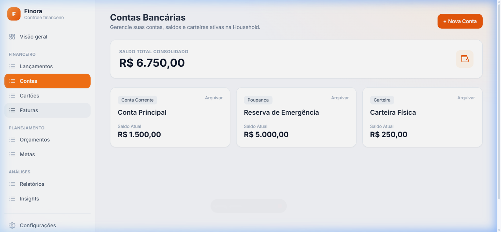
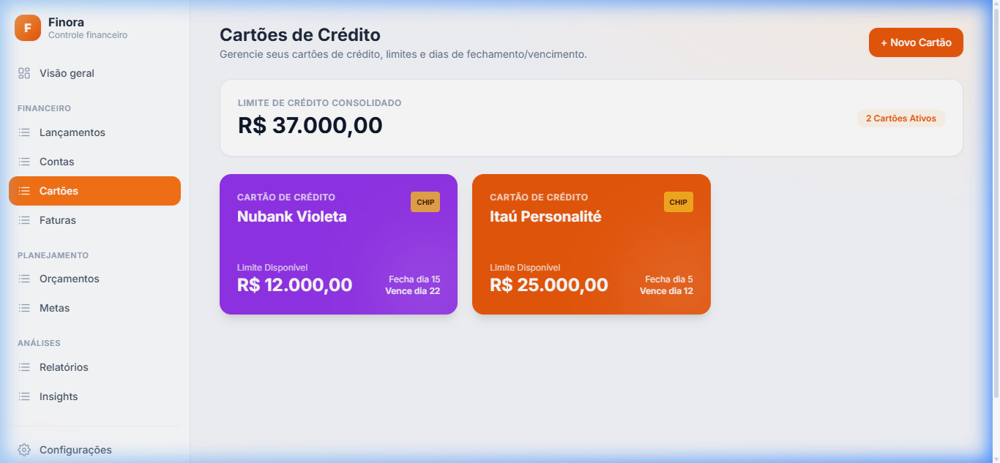
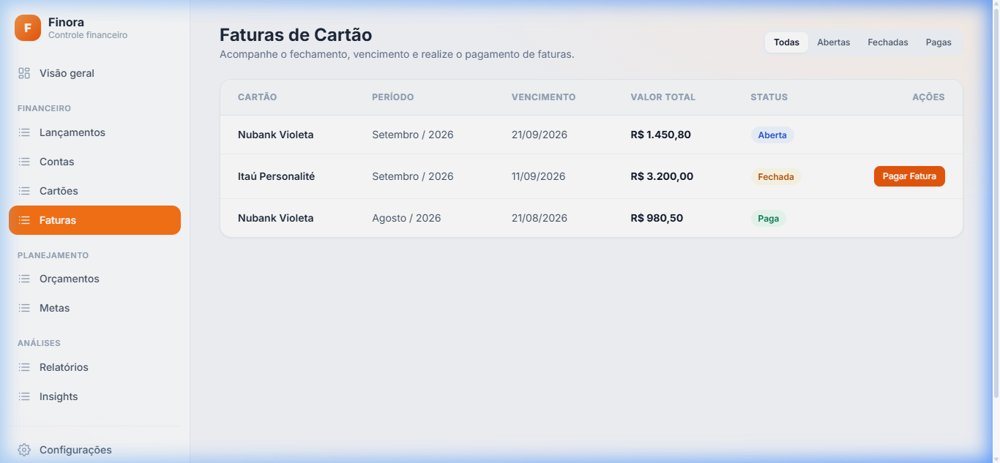
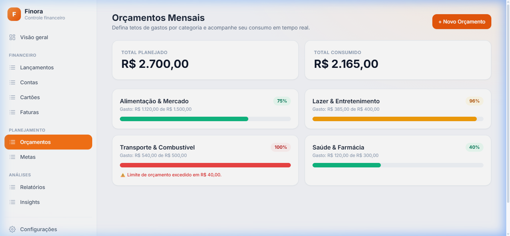
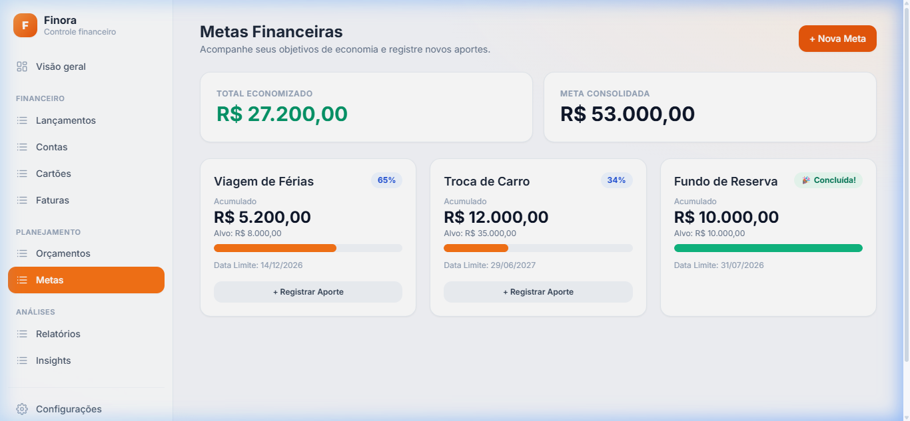
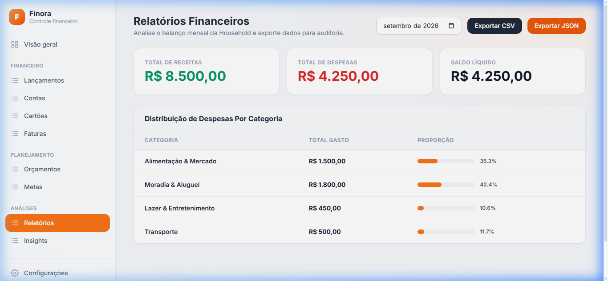
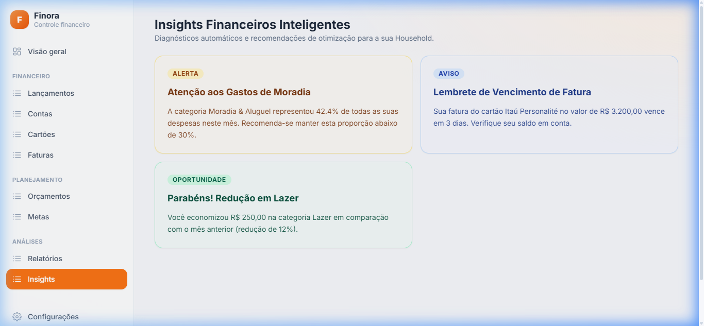

# ⚡ Finora — Controle Financeiro Pessoal & Familiar SaaS

> Plataforma moderna de gestão financeira pessoal e familiar **offline-first**, com arquitetura **Supabase RLS fail-closed**, motor de sincronização em segundo plano, gestão de cartões/faturas, orçamentos inteligentes, metas e faturamento recorrente.

🌐 **Deploy em Produção**: [https://finora.joaocarlosrh23.workers.dev/](https://finora.joaocarlosrh23.workers.dev/)

---

## 🎨 Screenshots & Módulos da Plataforma

### 💳 1. Contas Bancárias
Gerenciamento de contas correntes, poupanças e carteiras com saldo total consolidado em BRL.


---

### 💳 2. Cartões de Crédito
Controle de limites totais, dia de fechamento de fatura (`closing_day`) e dia de vencimento (`due_day`).


---

### 📄 3. Faturas de Cartão por Ciclo
Visualização de faturas por status (Abertas, Fechadas e Pagas) com modal de quitação e débito em conta.


---

### 📊 4. Orçamentos Mensais por Categoria
Planejamento de limite de gastos por categoria com indicadores visuais de consumo (Verde < 80%, Laranja 80-99%, Vermelho $\ge$ 100%).


---

### 🎯 5. Metas Financeiras & Aportes
Acompanhamento de objetivos de economia, barras de progresso percentual e modal para registro de novos aportes.


---

### 📈 6. Relatórios Financeiros & Exportação de Dados
Balanço mensal de receitas, despesas e saldo líquido com suporte à exportação de dados nos formatos **CSV** e **JSON**.


---

### 💡 7. Insights Inteligentes
Diagnósticos automáticos sobre o comportamento financeiro da Household, variação atípica de gastos e alertas de vencimento ($\le 3$ dias).


---

## 🚀 Funcionalidades Principais

- 🔒 **Multi-tenancy RLS Fail-Closed**: Isolamento estrito de dados por Household com `FORCE ROW LEVEL SECURITY`.
- ⚡ **Offline-First Sync Engine**: Fila de mutações locais com idempotência (`client_mutation_id`) e sincronização automática ao reconectar.
- 💳 **Gestão Completa de Cartões & Faturas**: Cálculo automático de vencimentos via `@finora/core` e liquidação de faturas.
- 📊 **Orçamentos & Alertas de Consumo**: Alertas visuais de limite e FeatureGate para restrição por plano.
- 🎯 **Metas Financeiras**: Acompanhamento de metas de economia com registro de contribuições/aportes.
- 💳 **Billing & Webhooks Idempotentes**: Processamento idempotente de webhooks do Stripe gravando em `subscription_events` e máquina de estados de assinaturas (trial 14d, carência `past_due` 7d, downgrades).
- 🧪 **30 Seções de Teste PGlite & Vitest 100% GREEN**: Testes locais em PostgreSQL puro no navegador via `@electric-sql/pglite`.

---

## 🛠️ Tecnologias Utilizadas

- **Frontend**: React 19, TypeScript, Vite, Tailwind CSS, Lucide Icons.
- **Backend & Database**: Supabase (PostgreSQL), Edge Functions, RLS Policies, RPCs SQL Atômicas.
- **Offline & Core Engine**: TypeScript ESM (`@finora/core`), Custom Mutation Queue.
- **Testes & QA**: Vitest, PGlite (Native In-Memory Postgres Runner).
- **Deployment**: Cloudflare Workers / Pages CI/CD.

---

## 💻 Como Rodar Localmente

### 1. Clonar o repositório
```bash
git clone https://github.com/JoaoSantosCodes/Finora.git
cd Finora/App
```

### 2. Instalar dependências
```bash
npm install
```

### 3. Executar o servidor de desenvolvimento
```bash
npm run dev
```
Acesse `http://localhost:5173/` no seu navegador.

---

## 🧪 Executar Testes

### Executar a suíte de banco PGlite (30 Seções)
```bash
npm run test:db
```

### Executar a suíte Vitest (21 suítes / 57 testes)
```bash
npx vitest run
```

### Compilar para Produção
```bash
npm run build
```

---

## 📄 Licença

Este projeto está sob a licença MIT. Desenvolvido por **João Santos**.
