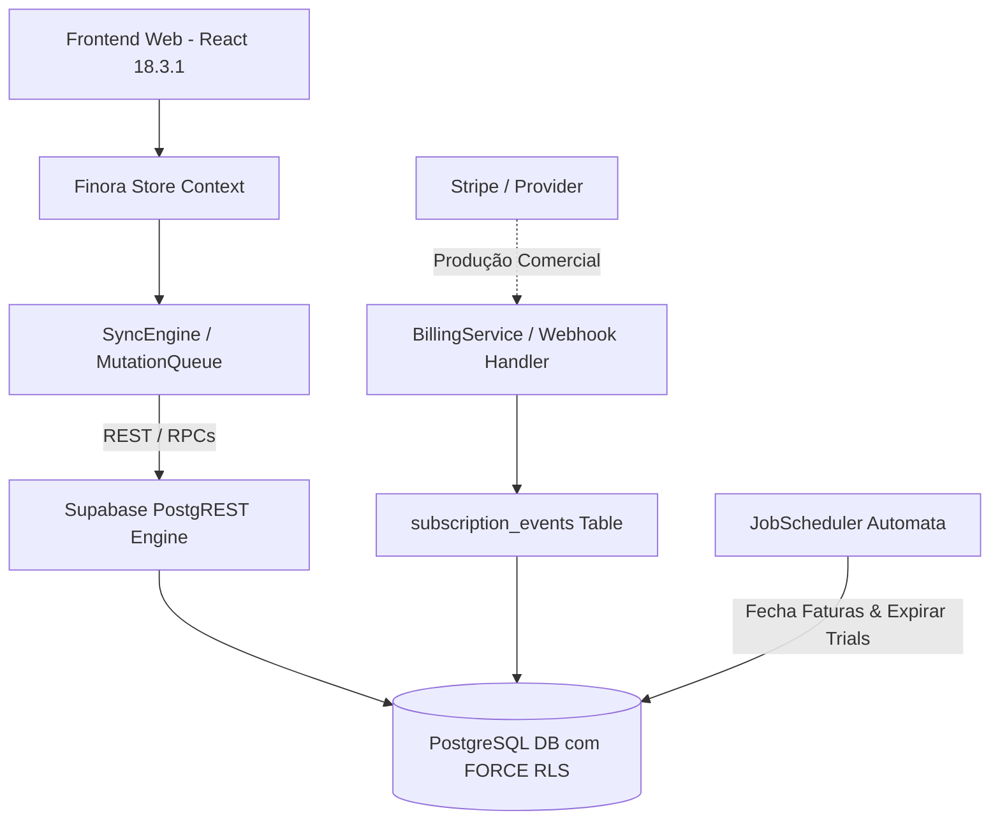

# 📑 Documento de Arquitetura & Estrutura Técnica — Finora SaaS

> Especificação de arquitetura, topologia de software, modelo de dados, políticas de segurança, fronteiras financeiras e status dos módulos do **Finora SaaS**.

---

## 📌 1. Visão Geral da Arquitetura do Sistema

O Finora é concebido sobre uma arquitetura monorepo moderna, estruturado em camadas desacopladas que separam o **Domínio Financeiro Puro** (`@finora/core`), os **Serviços de Aplicação** (`src/api/services`), a **Infraestrutura de Banco de Dados** (`Supabase / PostgreSQL`) e a **Interface de Usuário** (`apps/web`).



---

## 📌 2. Topologia Monorepo & Árvore Estrutural

O repositório adota uma topologia modular com workspace monorepo preparado para expansão multi-plataforma:

```text
Finora/
├── apps/
│   ├── web/                     # Aplicativo Web React 18.3.1 (Vite + Tailwind)
│   └── mobile/                  # Espaço arquitetural reservado para aplicativo móvel
│
├── packages/
│   ├── core/                    # Módulo central puro de regras financeiras (@finora/core)
│   ├── api-client/              # Cliente SDK TypeScript fortemente tipado
│   └── config/                  # Configurações compartilhadas de TypeScript, ESLint e build
│
├── src/                         # Módulos de aplicação e componentes da interface
│   ├── api/
│   │   ├── billing/             # BillingService e máquina de estados de assinaturas (BILL-002)
│   │   ├── db/                  # Cliente e utilitários Supabase
│   │   ├── jobs/                # JobScheduler e automações periódicas (JOB-001)
│   │   ├── repositories/        # Repositórios com delegação a RPCs PostgreSQL
│   │   ├── services/            # Serviços de aplicação (Account, Transaction, Transfer, etc.)
│   │   ├── sync/                # SyncEngine, MutationQueue e reconciliação de estado
│   │   └── v1/                  # Controllers REST e rotas HTTP (/v1/*)
│   │
│   ├── components/              # Componentes de interface do usuário React 18
│   │   ├── Dashboard.tsx        # Visão Geral consolidada
│   │   ├── Lancamentos.tsx      # Gestão de Receitas, Despesas e Transferências
│   │   ├── Contas.tsx           # Gestão de Contas Bancárias (FASE 6A)
│   │   ├── Cartoes.tsx          # Gestão de Cartões de Crédito (FASE 6B)
│   │   ├── Faturas.tsx          # Gestão de Faturas por Ciclo (FASE 6B)
│   │   ├── Orcamentos.tsx       # Orçamentos por Categoria com alertas (FASE 6C)
│   │   ├── Metas.tsx            # Metas Financeiras e Aportes (FASE 6D)
│   │   ├── Relatorios.tsx       # Relatórios com Exportação CSV/JSON (FASE 6E)
│   │   ├── Insights.tsx         # Insights Inteligentes e Alertas (FASE 6E)
│   │   └── Configuracoes.tsx    # Perfil, Membros e Categorias
│   │
│   ├── data/                    # Mocks e dados locais temporários da V0
│   ├── lib/                     # Utilitários auxiliares de UI e formatação
│   ├── store.tsx                # Contexto reativo de estado
│   └── App.tsx                  # Componente raiz e roteamento por abas
│
├── supabase/
│   ├── migrations/              # Migrações SQL versionadas (0001 a 0008)
│   └── tests/                   # Runner nativo PostgreSQL PGlite (30 Seções)
│
├── docs/                        # Documentação técnica e relatórios de auditoria
│   ├── screenshots/             # Galeria visual dos módulos
│   ├── ARCHITECTURE.md          # Este documento técnico
│   └── PROJECT_STATUS_AUDIT.md  # Relatório detalhado de auditoria de status
│
└── package.json                 # Configuração de dependências e scripts npm
```

---

## 📌 3. Stack Tecnológico & Dependências Reais

| Componente | Tecnologia | Versão Exata | Papel no Sistema |
|---|---|---|---|
| **UI Library** | React | `18.3.1` | Biblioteca de componentes de interface |
| **Bundler** | Vite | `6.4.3` | Compilação e HMR em desenvolvimento |
| **Linguagem** | TypeScript | `5.5.3` | Tipagem estática em todo o monorepo |
| **Estilização** | Tailwind CSS | `3.4.7` | Estilos utilitários e design system |
| **Gráficos** | Recharts | `2.12.7` | Gráficos visuais do Dashboard e Relatórios |
| **Database** | Supabase / Postgres | `2.112.4` (Client) | Banco de Dados multi-tenant PostgreSQL |
| **Test Runner** | Vitest | `4.1.11` | Suíte de testes unitários e de integração |
| **In-Memory DB** | `@electric-sql/pglite` | `0.2.17` | Runner nativo Postgres em ambiente de teste |

---

## 📌 4. Fronteiras de Precisão Financeira (`Integer Money Policy`)

Para impedir qualquer imprecisão por arredondamento de pontos flutuantes (`float`), o Finora adota uma política estrita de dinheiro inteiro:

1. **Camada de Apresentação (UI)**:
   - Recebe valores informados pelo usuário em formato decimal (ex: `150.50`).
   - Converte imediatamente para **centavos de inteiro** (`15050`) via `Money.fromDecimal()`.

2. **Domínio Core (`@finora/core`)**:
   - Trabalha exclusivamente com `number` inteiro representando centavos.
   - Parcelamentos e cálculos de saldo aplicam ajuste de centavos residuais na primeira parcela, garantindo que $\sum \text{parcelas} \equiv \text{total}$.

3. **Repositórios e PostgreSQL**:
   - Armazena valores nas colunas do banco com o tipo `BIGINT` (representando centavos).
   - As conversões entre `number` e `BIGINT` ocorrem estritamente na borda dos repositórios, evitando `Number(bigint)` arbitrários no meio da regra de negócio.

---

## 📌 5. Segurança, RLS & RPCs Atômicas

- **Fail-Closed Security**: Todas as tabelas financeiras possuem `ENABLE ROW LEVEL SECURITY` e `FORCE ROW LEVEL SECURITY`.
- **Isolamento de Tenant**: A função SQL `is_household_member(h_id)` valida a pertença de `auth.uid()` antes de permitir qualquer operação.
- **Audit Logs Imutáveis**: A tabela `audit_logs` possui RLS ativo sem políticas de `UPDATE` ou `DELETE` para perfil autenticado, funcionando estritamente em modo append-only.
- **RPCs SECURITY INVOKER**:
  - `rpc_transfer_funds`: Garante débito e crédito atômicos entre contas da mesma Household com rollback completo em falhas.
  - `rpc_create_installment_transaction`: Cria transações parceladas atomicamente.
  - `rpc_delete_transaction_with_audit`: Exclui lançamentos inserindo auditoria simultânea.

---

## 📌 6. Matriz de Status dos Módulos (Resultado da Auditoria)

| Módulo / Camada | Status Atual | Nota | Descrição & Diagnóstico da Auditoria |
|---|---|---|---|
| **Database Schema** | 🟢 **Concluído** | `9.0 / 10` | Migrações `0001` a `0008` completas, RLS FORCE, Triggers de Auth e RPCs atômicas. |
| **Financial Core** | 🟢 **Concluído** | `9.0 / 10` | Regras puras em `@finora/core` (`money`, `transactions`, `invoice`, `entitlement`, `auth`). |
| **Repositories** | 🟢 **Concluído** | `8.5 / 10` | Camada de repositórios delegando operações críticas a RPCs SQL atômicas. |
| **Application Services** | 🟢 **Concluído** | `8.0 / 10` | Serviços de aplicação (Account, Transaction, Transfer, CreditCard, Analytics, Billing). |
| **API REST V1** | 🟢 **Concluído** | `8.0 / 10` | Roteador HTTP `/v1/*` estruturado. |
| **FeatureGate & Planos** | 🟢 **Concluído** | `9.0 / 10` | Matriz de limites por plano (Free, Pro, Família) pronta. |
| **Offline Sync / Reconciliação** | 🟡 **Infra Pronta** | `6.0 / 10` | Tabelas de mutação idempotente `sync_mutations` e rotas ativas; reconciliação IndexedDB em fechamento. |
| **Billing / Stripe** | 🟡 **Base Local** | `6.0 / 10` | BillingService e `subscription_events` implementados localmente; Checkout Stripe reservado para fase comercial. |
| **Frontend UI (Telas)** | 🟢 **Telas Prontas** | `8.0 / 10` | 100% dos componentes de telas (Contas, Cartões, Faturas, Orçamentos, Metas, Relatórios, Insights) implementados. |
| **Android / Mobile App** | 🔴 **Reservado** | `1.0 / 10` | Estrutura monorepo `apps/mobile` reservada no repositório; desenvolvimento planejado para fase posterior. |

---

## 🎯 7. Diretriz de Desenvolvimento: Próximo Marco (GATE 2)

A auditoria confirma que a fundação de banco de dados e backend já ultrapassou o **GATE 1**. A prioridade estratégica do projeto é o **GATE 2 — Integração Completa do Produto**:

1. **GATE 1 (Concluído ✅)**: Fundação de Banco de Dados, RLS, RPCs e Core Financeiro.
2. **GATE 2 (Próximo Alvo 🎯)**: Conexão completa da UI React com a API Supabase remota, migração definitiva do LocalStorage/V0 e fechamento da sincronização offline no cliente.
3. **GATE 3 (Fase Comercial 🚀)**: Ativação do Stripe Checkout em produção, PWA e aplicativo móvel Android.
