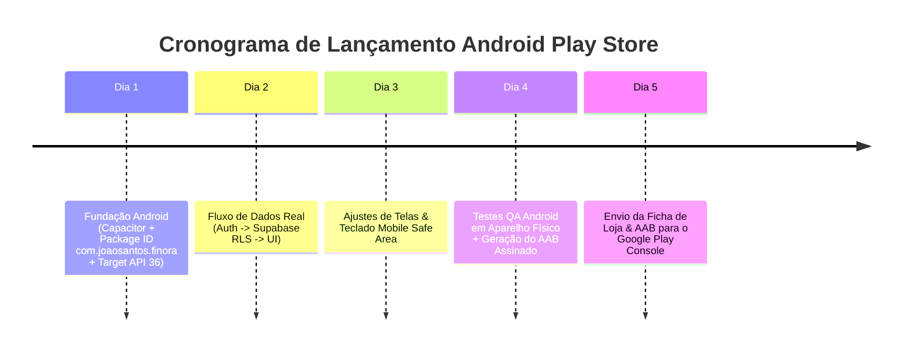

# 🚀 Finora 1.0 — Guia & Checklist de Lançamento Android (Play Store MVP)

> Estratégia de publicação rápida do **Finora SaaS V1.0** para o Google Play Store focada na esteira **React + Vite → PWA → Capacitor → Android AAB (Target API 36 / Android 16)**.

---

## 📌 1. Escopo Definido do Play MVP (GATE 2A)

### 🟢 O que ENTRA na Versão 1.0 MVP:
- 🔐 **Autenticação Supabase**: Login e Cadastro com E-mail/Senha, persistência de sessão e `AuthContext`.
- 👤 **Perfil do Usuário & Household**: Resolução automática do `profile_id`, pertença de `household_id` e papel (`owner`/`admin`/`member`).
- 🏠 **Visão Geral (Dashboard)**: Saldo total em BRL, atalhos e gráficos de despesas por categoria.
- 💵 **Contas Bancárias**: Listagem, criação e saldo consolidado.
- 📝 **Lançamentos**: Criação, edição e exclusão de Receitas, Despesas e Transferências.
- 📊 **Categorias**: Classificação visual por categoria.
- 💳 **Cartões de Crédito**: Listagem de cartões e faturas.
- ⚙️ **Configurações**: Perfil da Household e gestão de membros.
- 📲 **Capacitor Mobile Bridge**: Encapsulamento nativo Android com `targetSdk 36` (Android 16).

### ❌ O que FICA para a Versão 1.1+ (Pós-Lançamento):
- Stripe Checkout em Produção & Cobrança Comercial (GATE 2C).
- Motor Avançado de SyncEngine Offline com Reconciliação IndexedDB complexa (GATE 2B).
- Push Notifications nativas, Biometria e Widgets Android (GATE 2D).

---

## 📱 2. Especificação do Aplicativo Android (Capacitor)

| Parâmetro | Valor Configurado |
|---|---|
| **Package Name / App ID** | `com.joaosantos.finora` |
| **App Name** | Finora — Controle Financeiro |
| **Target SDK Version** | `36` (Android 16 / Requisito Google Play 2026) |
| **Compile SDK Version** | `36` |
| **Min SDK Version** | `24` (Android 7.0+) |
| **Arquitetura de Build** | React + Vite + Capacitor 6 |
| **Formato de Entrega** | Android App Bundle (`.aab` assinado) |

---

## 📋 3. Checklist Completo de Publicação (Play Store MVP)

### 🔐 A. Autenticação & Segurança
- [x] Sessão de autenticação gerenciada via `AuthContext` (`src/lib/auth_context.tsx`).
- [x] Isolamento multi-tenant garantido no Supabase via `is_household_member` com `FORCE ROW LEVEL SECURITY`.
- [x] Prevenção de vazamento de chaves `service_role` (frontend consome apenas `anon_key` com JWT do usuário).
- [x] Tratamento de sessão expirada e fallback gracioso para ambiente offline.

### 💰 B. Funcionalidades Financeiras Básicas
- [x] Criar, editar e listar contas bancárias.
- [x] Criar, editar e excluir transações de Receita, Despesa e Transferência.
- [x] Visualizar faturas e orçamentos.
- [x] Assistente de migração transparente de dados legados do LocalStorage (`MigrationWizard.tsx`).

### 📱 C. Empacotamento Android (Capacitor)
- [ ] Instalação e inicialização do `@capacitor/core`, `@capacitor/cli` e `@capacitor/android`.
- [ ] Configuração do `capacitor.config.json` com `appId: "com.joaosantos.finora"`.
- [ ] Geração da pasta nativa `android/` com `build.gradle` configurado para `targetSdkVersion 36`.
- [ ] Teste e verificação no emulador Android ou dispositivo físico.
- [ ] Geração do arquivo de distribuição assinado `app-release.aab`.

### 🎨 D. Assets da Play Store
- [ ] Ícone do aplicativo ($512 \times 512$ px, PNG de alta qualidade).
- [ ] Imagem de recursos / Feature Graphic ($1024 \times 500$ px).
- [ ] Capturas de tela (mínimo 4 screenshots por formato: celular e tablet).
- [ ] Descrição curta (até 80 caracteres) e Descrição longa (até 4000 caracteres).
- [ ] Política de Privacidade publicada em URL pública ([`https://finora.joaocarlosrh23.workers.dev/privacy.html`](https://finora.joaocarlosrh23.workers.dev/privacy.html)).

---

## 🗓️ 4. Cronograma de Execução Focada (5 Dias para Produção)

